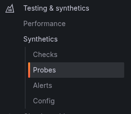

Synthetic Monitoring Agent
==========================
This is the 'worker' for Grafana's [Synthetic Monitoring application](https://github.com/grafana/synthetic-monitoring-app). The agent provides probe functionality and executes network [checks](https://github.com/grafana/synthetic-monitoring-app/blob/main/README.md#check-types) for monitoring remote targets. 

Please [install](https://grafana.com/grafana/plugins/grafana-synthetic-monitoring-app/installation) Synthetic Monitoring 
in your Grafana Cloud or local Grafana instance before setting up your own private probe. You may need to generate a [new API key](https://grafana.com/profile/api-keys) to initialize the app.

Probes
------
Probes run [checks](https://github.com/grafana/synthetic-monitoring-app/blob/main/README.md#check-types) from 
distributed locations around the world and send the resulting metrics and events directly to 
[Grafana Cloud](https://grafana.com/products/cloud/) Prometheus and Loki services. 

You can select 1 or more **public** probes to run checks from or [run your own **private** probes](https://grafana.com/docs/grafana-cloud/synthetic-monitoring/private-probes/)
from any environment you choose.

Run your own private probe
---------------------

Please refer to [Private Probe docs](https://grafana.com/docs/grafana-cloud/synthetic-monitoring/private-probes/) for details.

See [examples/kubernetes](./examples/kubernetes) for the documentation and example yaml files

Signals
-------

The agent traps the following signals:

* SIGTERM: The agent tries to clean up and shut down in an orderly
  manner.
* SIGUSR1: The agent disconnects from the API but keeps running checks.
  After 1 minute elapses, the agent will try to reconnect to the API and
  keep trying until it succeeds or it's killed. One possible use case is
  upgrading a running agent with a newer version: after SIGUSR1 is sent,
  the agent disconnects, allowing another agent to connect in its place.
  If the new agent fails to connect, the old agent will reconnect and
  take it from there. 
  You can also use `/disconnect` endpoint to send SIGUSR1 to process.

Readiness
---------

You can use the `/ready` endpoint to check if probe has been able to
connect to the API and is ready to start processing checks. A status
code of 200 signals that the agent is ready. If the agent is not yet
ready, the response has a status code of 503.

Used in conjunction with the USR1 signal or `/disconnect` endpoint,
you can use this mechanism to ask a running agent to disconnect from the API,
and poll the `/ready` entrypoint in order to determine if the
new agent has been able to connect already.
