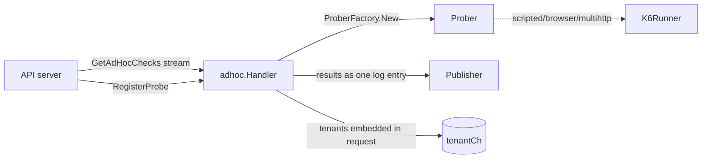

# Ad-hoc handler — `internal/adhoc`

## Purpose

The ad-hoc handler powers the **"test this check now"** flow from the
UI. A separate gRPC stream (`GetAdHocChecks`) carries one-shot probe
requests; the handler runs each request once, captures the output as a
single Loki log entry, and forwards it to the publisher. No
scheduling, no retry, no scraper, no metric publishing.

Where the [Updater](updater.md) is about *managing
recurring checks*, the ad-hoc handler is about *executing single
checks on demand*.

## Where it lives

`internal/adhoc/`

| File             | Responsibility                                          |
| ---------------- | ------------------------------------------------------- |
| `adhoc.go`       | `Handler`, `runner`, gRPC loop, `defaultRunnerFactory`. |
| `adhoc_test.go`  | Mocked-stream unit tests.                               |

## How it fits in



## Lifecycle

### Construction

`NewHandler(HandlerOpts)` is called from
`cmd/synthetic-monitoring-agent/main.go`. The options are deliberately
a subset of the Updater's: gRPC connection, logger, back-off,
publisher, tenant channel, Prometheus registerer, features, k6 runner,
secret provider, `SupportsProtocolSecrets`.

The handler builds its own `prober.ProberFactory` with **`probeId = 0`**,
intentionally — ad-hoc runs must not inject the `x-sm-id` request
header, which the factory only adds when `probeId != 0`. The
`ProberFactory` is built once in `NewHandler` and never updated, even
after `RegisterProbe` returns a probe identity.

The `runnerFactory` and `grpcAdhocChecksClientFactory` option fields
are *unexported* — they exist purely to let tests inject fakes
without exposing the seam in the public API.

### Run loop

`Handler.Run(ctx)`:

```mermaid
sequenceDiagram
    participant Run as Handler.Run
    participant Loop as Handler.loop
    participant API as API server
    participant Proc as processAdHocChecks
    participant Runner as runner.Run

    Run->>Loop: loop()
    Loop->>API: RegisterProbe (ad-hoc)
    Loop->>API: GetAdHocChecks (stream)
    Loop->>Proc: processAdHocChecks
    loop request received
        Proc->>Runner: go runner.Run (one-shot)
        Runner->>Publisher: Publish(adhocData{logs only})
    end
    Note over Loop: stream ends / error
    Loop-->>Run: classified error
    alt errIdleTimeout
        Run->>Run: reset backoff, sleep, retry
    else errTransportClosing
        Run->>Run: reset backoff, retry
    else errProbeUnregistered
        Run->>Run: sleep 1 minute, retry
    else fatal (auth / incompatible)
        Run-->>Run: return err
    end
```

`Run`'s outer loop classifies errors and decides whether to retry,
exit, or sleep. Notable differences from the Updater's error handling:

- `codes.Unavailable` → `errIdleTimeout` rather than a generic transient error. Ad-hoc streams are expected to idle when no one is using the UI; the handler reconnects without alarm.
- `errProbeUnregistered` triggers a fixed **1-minute sleep** before retrying — there is no scenario in which retrying faster helps.
- Fatal codes (`PermissionDenied`, `Unimplemented`) cause `Run` to exit, which under the `errgroup` in `cmd/` brings the whole agent down (intentional: a misconfigured ad-hoc handler is a misconfigured agent).

The default back-off is a `constantBackoff(60 * time.Second)` — set
inside `NewHandler` when no `Backoff` is supplied. In practice
`cmd/` supplies the same exponential back-off as the Updater.

### Per-request handling

`processAdHocChecks` consumes the stream. Each `AdHocRequest` becomes:

1. `defaultRunnerFactory(ctx, req)` builds a `runner` — constructs a one-off `model.Check` from the request, calls the prober factory, and computes a per-check timeout. For k6-backed types the timeout adds **`k6AdhocGraceTime` (20 s)** to keep the client and remote runner from timing out at the same moment.
2. `go runner.Run(ctx, tenantID, publisher)` runs the probe in a *new* goroutine and returns immediately so the stream consumer doesn't block.
3. If the request carried a tenant snapshot (`ahReq.Tenant != nil`), it's forwarded to `tenantCh` so the shared tenant manager learns about it.

`runner.Run`:

- Creates a fresh `prometheus.Registry` and registers two gauges (`probe_success`, `probe_duration_seconds`).
- Captures the probe's logger output via the in-package `jsonLogger` (`adhoc.go`) — a `logger.Logger`-shaped sink that collects `[]map[string]string`.
- Calls `prober.Probe(ctxWithTimeout, target, registry, jsonLogger)`.
- Gathers metric families and serialises a **single** zerolog warn-level JSON message containing `id`, `target`, `probe`, `check_name`, the collected `logs`, and the gathered `timeseries`.
- Wraps that JSON line in an `adhocData{streams: [...]}` and calls `publisher.Publish`. `adhocData.Metrics()` always returns `nil` — ad-hoc results never go through remote-write, only Loki push.

The fixed Loki label set is:
`{probe="<name>", source="synthetic-monitoring", type="adhoc"}`

Operators use the `type="adhoc"` label to filter ad-hoc results out of
normal alerting.

### Shutdown

Parent context cancellation unwinds the stream consumer and the run
loop. Outstanding `runner.Run` goroutines hold no scraper state and
end naturally when their context is cancelled. There is no graceful
"drain" — ad-hoc results are best-effort.

## Differences from the Updater

| Aspect                       | Updater                                | Adhoc                                              |
| ---------------------------- | -------------------------------------- | -------------------------------------------------- |
| Stream RPC                   | `GetChanges`                           | `GetAdHocChecks`                                   |
| Scheduling                   | Per-check `Scraper.Run` ticker         | None — single probe call per request.              |
| Retry                        | Reconnect-only; checks rerun on schedule | None — failed probes are reported as failed.    |
| Result destination           | Prometheus + Loki via Publisher        | Loki only (one JSON log line per run).             |
| Probe identity               | `probeId` injected into HTTP headers   | `probeId = 0`; no header injection.                |
| State held between runs      | Scrapers, payload memory               | None — every request is fresh.                    |
| Failure of one request       | Logged, scraper continues              | Logged via `processAdHocChecks`; stream continues. |
| Tenant changes from API      | Forwarded via `tenantCh`               | Same — embedded in request when present.          |

The shared resources are the gRPC connection, the publisher, the
prober factory, the secret provider, and the k6 runner. None of
those are duplicated.

## Key types and entry points

| Type / function                       | File         | Notes                                                 |
| ------------------------------------- | ------------ | ----------------------------------------------------- |
| `Handler`                             | `adhoc.go`   | The struct.                                           |
| `HandlerOpts`                         | `adhoc.go`   | Construction inputs from `cmd/`.                      |
| `NewHandler(opts)`                    | `adhoc.go`   | Registers `sm_adhoc_ops_total`, wires defaults.       |
| `(*Handler).Run(ctx)`                 | `adhoc.go`   | Reconnect/back-off loop, error classification.        |
| `(*Handler).loop(ctx)`                | `adhoc.go`   | One full connected session.                           |
| `processAdHocChecks(ctx, client)`     | `adhoc.go`   | Stream consumer.                                      |
| `(*Handler).handleAdHocCheck(...)`    | `adhoc.go`   | One request → one goroutine.                          |
| `defaultRunnerFactory(...)`           | `adhoc.go`   | Builds the per-request `runner`.                      |
| `runner.Run(ctx, tenantID, publisher)`| `adhoc.go`   | Executes the probe; emits one log entry.              |
| `jsonLogger`                          | `adhoc.go`   | In-memory `logger.Logger` for capturing probe logs.   |
| `adhocData`                           | `adhoc.go`   | `pusher.Payload` impl: streams only, no time series.  |

The single Prometheus metric the handler owns is
`sm_adhoc_ops_total{type}`, incremented when an `AdHocRequest`
arrives.

## Testing strategy

`adhoc_test.go` exercises:

- Stream wiring and reconnect classification (using injected `grpcAdhocChecksClientFactory`).
- Per-request handling via injected `runnerFactory`.
- Tenant forwarding (`tenantCh`).
- Error mapping (`errNotAuthorized`, `errIncompatibleApi`, `errIdleTimeout`, `errProbeUnregistered`).

The pattern matches the Updater's tests: mock gRPC client and probes,
drive the handler, assert observable side-effects. No real network is
required.

Run only this package:

```bash
make test-go GO_TEST_ARGS=./internal/adhoc/...
```

## When to update this doc

Update this document when you:

- Change the `AdHocChecks` gRPC contract (RPCs, request/response shape).
- Change how `defaultRunnerFactory` builds the synthetic `model.Check` (timeout selection, grace time, settings copy).
- Change the Loki label set on ad-hoc payloads (`adhocData.Streams` shape) — operators filter on `type="adhoc"`.
- Add a new error class to `Run`'s switch — including the `errIdleTimeout` handling that differs from the Updater.
- Change the `probeId = 0` assumption in the prober factory wiring.
- Add a new top-level field to `HandlerOpts`.
- Change the contents of the JSON log emitted by `runner.Run` (downstream UI parses it).
