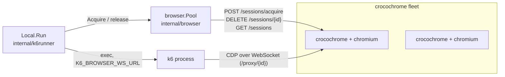

# Browser pool client — `internal/browser`

## Purpose

Browser checks are k6 scripts driving a headless Chromium. By default the
agent runs that Chromium locally (k6 launches it as a child process), which
means every agent image must ship a browser. The browser pool client
decouples the two: it allocates browser sessions from an externally managed
fleet of single-session [crocochrome](https://github.com/grafana/crocochrome)
instances and hands k6 a CDP WebSocket URL to connect to, via the
`K6_BROWSER_WS_URL` environment variable.

The feature is **off by default**: it activates only when
`-browser-pool-addresses` or `-browser-pool-discover` is set (and the `k6`
feature is enabled). When off, browser checks run against a local Chromium
exactly as before. Nothing in this document applies unless one of those flags
is set.

This is a client-driven design: there is no allocator service. Each agent
probes the fleet directly, and the correctness anchor is crocochrome's atomic
create-if-free acquire (`POST /sessions/acquire`: 200 free / 409 busy /
503 draining), backed by its server-side session timeout (~5m) that reaps
anything leaked. Everything the agent tracks is a heuristic to keep probe
counts low; it can be stale without ever being unsafe.

## How it fits in



- `main.go` builds one `browser.Pool` (when configured) and hands it to the
  k6 runner through the `k6runner.BrowserPool` interface, which the pool
  satisfies *structurally*: `internal/browser` imports `internal/k6runner`
  (for `CheckInfo`), so k6runner cannot import browser back.
- The Local k6 runner acquires a session per browser-check execution, injects
  the returned WebSocket URL into the k6 process environment, and releases
  the session when the run ends (see [k6runner.md](k6runner.md)).
- A single `Pool` is shared by all concurrent check executions; all state is
  serialized under one mutex.

## State model

The pool keeps a **self-organizing ordered list** of instances: position
encodes the likelihood of being free, front = most probably free. It is the
classic LRU pairing of `container/list` (O(1) moves) plus a
`map[baseURL]*list.Element` index (O(1) lookup by address).

```go
type instance struct {
    baseURL   string
    busy      bool   // claimed by this agent: an Acquire is probing it, or we hold its session
    sessionID string // non-empty when this agent owns the active session
}
```

Two distinct mechanisms answer two distinct questions:

- **List position** answers "what is the fleet state?" — maintained by probe
  outcomes and by the sync loop for *every* instance, including sessions
  created by other agents. Observed/reported busy → sink to the back;
  observed free / released → float to the front.
- **The `busy` flag** answers "is this agent using it?" — a local claim, set
  when an Acquire picks the instance and kept while we hold its session. It
  is *not* a belief about remote state: only our own release clears it (an
  event we always get), whereas another agent's session ending would not be.
  Busy instances are non-allocatable, exempt from sync reordering, and never
  pruned.

A side-effect of the self-organizing order: each agent's list diverges with
its own allocation history, which decorrelates probe order across agents
sharing the pool.

## Acquire

1. Claim the frontmost non-busy instance under the mutex (`busy = true`), so
   concurrent Acquires on this agent never probe the same instance.
   Cross-agent races are resolved by crocochrome's 409.
2. `POST /sessions/acquire` (bounded ~10s; it launches Chromium). 200 → keep
   `busy`, record the session, move to the back, return the WebSocket URL
   plus an idempotent release closure. 409/503/error → clear `busy`, move to
   the back, try the next candidate.
3. After a full sweep of the fleet without success, back off with jitter
   (250ms–2s) and sweep again, until the caller's context expires →
   `ErrPoolExhausted`. The runner surfaces that as a failed check — pool
   exhaustion is a visible monitoring gap, not a silent queue.

Release DELETEs the session (bounded ~10s) and returns the instance to the
front **unconditionally**, even if the DELETE fails: the next probe's 409
corrects a wrong guess, and crocochrome's session timeout reclaims the
session.

## Sync loop

Started by `New` (no separate start call) and stopped by cancelling the
context passed to it; one sync runs immediately so membership is populated at
construction, then every 15s:

1. **Resolve the fleet** by calling `Config.Discover`, a
   `discovery.DiscoverFn` that `main` builds from the flags via the
   [`internal/discovery`](../../internal/discovery/) package, from either the
   configured addresses or the go-discover config (mutually exclusive).
   - `[prefix+]host[:port]` addresses: literal IPs pass through; names are
     resolved by prefix — `dns+` (A/AAAA), `dnssrv+` (SRV, targets then
     resolved as A/AAAA), `dnssrvnoa+` (SRV, targets as-is), and no prefix
     (A/AAAA, falling back to SRV then A/AAAA). A headless Service resolves to
     all its ready pods. Addresses are resolved independently and unioned
     (per-address fail-open: an error is returned only when nothing resolves).
   - A `provider=k8s` config queries the Kubernetes API for pod IPs.

   Discovery applies the default instance port (`browser.DefaultInstancePort`,
   8080, crocochrome's default) to addresses without one; SRV record ports are
   ignored. The pool turns the results into `http://host:port` base URLs. A
   resolution error keeps the current membership.
2. **Observe** every instance with `GET /sessions`, concurrently, outside the
   mutex.
3. **Apply** under the mutex: unknown instances join the list, then every
   instance reorders by observation (free → front, busy or unobservable →
   back);
   instances gone from discovery are pruned. Instances with a local claim
   (`busy`) are skipped entirely — the observation may predate the claim, and
   a pod dropped from discovery may still be draining our session, so it is
   pruned only after release.

Correctness never depends on the sync loop: it only reduces wasted probes.
The 409 gate is authoritative.

## Metrics

Namespace `sm_agent`, subsystem `browser_pool`:

| Metric | Meaning |
| --- | --- |
| `instances{state="free"\|"busy"}` | Pool size by state, where busy = claimed by **this agent**. The fleet-wide busy ratio is `avg()` of each instance's own `sm_crocochrome_session_active`, not duplicated here |
| `acquires_total{result="success"\|"exhausted"\|"error"}` | Per Acquire call; `exhausted` is the capacity signal (a check failed for lack of browsers) |
| `probes_total{result="acquired"\|"busy"\|"draining"\|"error"}` | Per attempt on an instance; probes/acquires ratio reflects contention |
| `acquire_duration_seconds` | Acquire latency histogram, success and failure |
| `releases_total{result="ok"\|"error"}` | Sustained errors mean sessions are reclaimed by the instance session timeout instead |
| `syncs_total{result="ok"\|"error"}` | Per tick (doubles as the loop's heartbeat); `error` = fleet resolution failed, tick reconciled known instances only |

## Configuration

| Flag | Meaning |
| --- | --- |
| `-browser-pool-addresses` | Comma-separated `[prefix+]host[:port]` addresses resolving the fleet via DNS (`dns+`, `dnssrv+`, `dnssrvnoa+`, or no prefix; see [Sync loop](#sync-loop)). Mutually exclusive with `-browser-pool-discover`. Presence enables the feature; instances are addressed as `http://host:port` (port defaults to 8080). Requires the `k6` feature |
| `-browser-pool-discover` | go-discover config resolving the fleet (k8s provider only), e.g. `provider=k8s namespace=... label_selector=...`. Mutually exclusive with `-browser-pool-addresses`. Presence enables the feature; instances without a port use 8080. Requires the `k6` feature |

The sync interval (15s) and the acquire budget (`min(checkTimeout/2, 30s)`,
enforced by the k6 runner) are not exposed as flags.

## Failure modes

| Failure | Effect | Recovery |
| --- | --- | --- |
| All instances busy until the acquire deadline | Check fails, `acquires_total{exhausted}` | Autoscaling on fleet utilization; next scheduled run |
| Agent dies mid-check | Session orphaned on its instance | Crocochrome session timeout (~5m) |
| Release DELETE fails | Session leaks on the instance; agent treats it free | Next probe's 409 corrects; session timeout reclaims |
| DNS/resolution outage | Membership frozen, `syncs_total{error}` | Reconcile of known instances continues; recovers on next successful tick |
| Instance scale-down mid-session | Pod leaves DNS while draining our session | Busy instances survive pruning until released; crocochrome drains on SIGTERM |

## Testing strategy

Unit tests (`internal/browser/pool_test.go`) run the pool against a fake
crocochrome fleet (`httptest`, real 200/409/503 create-if-free semantics),
covering ordering, claim serialization under concurrency (`-race`), release
idempotency and failure, sync merge rules, and metrics transitions. The k6
runner side is covered in `internal/k6runner/local_test.go` with a fake k6
binary that proves `K6_BROWSER_WS_URL` reaches the k6 process environment.
Fleet resolution (prefix grammar, SRV fallback, default port, partial
failure, flag validation) is covered in `internal/discovery/discovery_test.go`
with stubbed DNS and Kubernetes lookups.

## When to update this doc

- Acquire/release semantics or the state model change
  (`internal/browser/pool.go`).
- The sync loop's merge rules or discovery mechanism change
  (`internal/discovery/discovery.go`).
- Metrics or flags are added/renamed.
- The crocochrome API contract changes.
