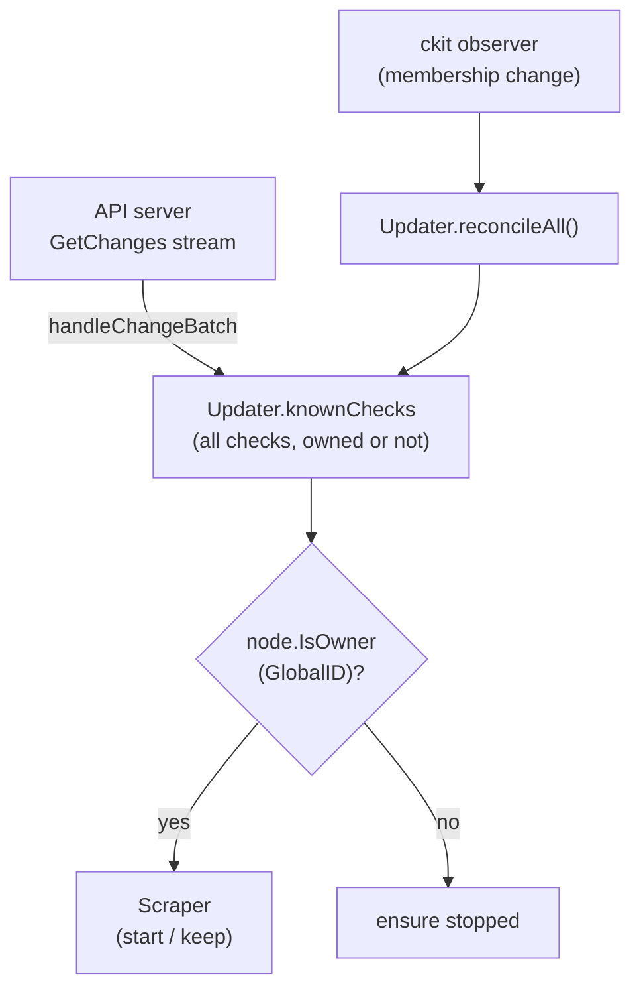

# Clustering / check ownership — `internal/cluster`

## Purpose

Clustering lets a group of interchangeable agents (a "ring") **split the checks
between them** instead of every agent running every check. Agents form a
gossip-based, eventually-consistent hash ring using the
[`grafana/ckit`](https://github.com/grafana/ckit) toolkit. Each check's
`GlobalID` is hashed onto the ring; under replication factor **RF=1** exactly one
agent owns (runs) it. When agents join or leave, every agent re-evaluates which
checks it owns and starts/stops scrapers accordingly.

Clustering is **off by default** (`-cluster-enabled=false`). When off, the agent
uses a no-op `monoNode` that owns every check — exactly the pre-clustering
behaviour. Nothing in this document applies unless `-cluster-enabled` is set.

The package exposes a narrow `Node` interface so the rest of the agent depends
only on two questions — "do I own this check?" (`IsOwner`) and "has the ring
converged enough to trust that answer?" (`Ready`). The Updater consumes that
interface; see [updater.md](updater.md).

## Prerequisite (read this first)

> Clustering relies on a **server-side change that is not in this repository**:
> the upstream `GetChanges` stream must broadcast the **same full check set to
> every agent in a ring**. Today the API tailors the stream per probe, so each
> agent only sees checks already assigned to it.
>
> Without that upstream change, the ring has nothing to partition — every agent
> sees a different, pre-filtered set, and ownership decisions are a no-op or
> wrong. This work is tracked separately. Do not enable clustering in production
> until the upstream feed delivers the full ring set.

## Where it lives

`internal/cluster/`

| File           | Responsibility                                                                                  |
| -------------- | ----------------------------------------------------------------------------------------------- |
| `node.go`      | `Node` interface; `monoNode` (owns everything); `RingNode` (ckit-backed); `shard.Ring(512)` ownership via `IsOwner`; `keyOf(GlobalID)` stable key encoding; readiness state machine (`Ready`); lifecycle (`Start` / `Stop`). |
| `transport.go` | `NewGossipClient` (`http2.Transport{AllowHTTP:true}`) and `NewGossipServer` (plaintext HTTP/2 / h2c) for gossip traffic.                                |
| `discovery.go` | `NewDiscoverer` — peer resolution via `hashicorp/go-discover` (k8s provider) and/or static `host[:port]`; `AdvertiseAddress` resolution from interfaces. |

## How it fits in

The Updater records **every** check it receives in `knownChecks` (its durable
desired state), then asks `node.IsOwner` whether to run each one. A ckit observer
fires on every participant-set change and triggers `reconcileAll()`, which
re-runs ownership over `knownChecks` and starts/stops scrapers. See
[updater.md](updater.md) for the reconcile machinery.

## Flags

All clustering flags are registered in `cmd/synthetic-monitoring-agent/main.go`
and grouped onto the `clusterConfig` struct; `buildClusterNode` maps them onto
`cluster.RingConfig`. Every flag is gated by `-cluster-enabled`.

| Flag                                 | Type     | Default                       | Purpose                                                                                          |
| ------------------------------------ | -------- | ----------------------------- | ------------------------------------------------------------------------------------------------ |
| `-cluster-enabled`                   | bool     | `false`                       | Form a gossip cluster so checks are split across agents (each check runs on one owning agent).   |
| `-cluster-node-name`                 | string   | hostname                      | Unique, stable name for this node in the cluster.                                                |
| `-cluster-advertise-address`         | string   | resolved                      | `host:port` other nodes use to reach this one. Resolved from advertise interfaces + listen port if unset. |
| `-cluster-advertise-interfaces`      | list     | `eth0,en0`                    | Interfaces to pick the advertise address from when `-cluster-advertise-address` is unset.        |
| `-cluster-listen-port`               | int      | `7946`                        | Port for gossip traffic (plaintext HTTP/2).                                                      |
| `-cluster-label`                     | string   | `""`                          | Cluster label; nodes only join peers sharing the same label.                                     |
| `-cluster-join-addresses`            | list     | `[]`                          | Peers to join: go-discover configs (e.g. `provider=k8s namespace=sm label_selector=app=sm-agent`) and/or `host[:port]` addresses. |
| `-cluster-minimum-size`              | int      | `0`                           | Minimum cluster size (incl. self) before ownership is trusted; `0` or `1` makes a lone agent run everything. |
| `-cluster-minimum-size-wait-timeout` | duration | `0` → 60s (`DefaultMinimumSizeWaitTimeout`) | How long to wait to reach `-cluster-minimum-size` before running checks anyway (fail-open).      |
| `-cluster-rejoin-interval`           | duration | `0` → 60s (`DefaultRejoinInterval`)         | How often to re-resolve peers and re-join, picking up scale-ups.                                 |
| `-cluster-drain-timeout`             | duration | `0` → 10s (`DefaultDrainTimeout`)           | On shutdown, how long to stay in the cluster as Terminating after announcing departure.          |

The `0 → N` defaults are applied inside `NewRingNode` from constants in
`internal/cluster/node.go`; a literal `0` on the command line means "use the
constant", not "disabled".

## Deployment topology

Clustering is designed for a Kubernetes deployment where every agent in a region
is an interchangeable ring member:

- **Stable identity.** `-cluster-node-name` defaults to the hostname, which is the
  stable pod name under a `StatefulSet`. Leave it unset and run agents as a
  `StatefulSet` so names survive restarts.
- **Gossip transport.** Each agent listens on `-cluster-listen-port` (default
  `7946`) for plaintext HTTP/2 (h2c) gossip, on a dedicated listener separate from
  the metrics/health HTTP server.
- **Advertise address.** Other nodes reach this one at
  `-cluster-advertise-address`. If unset, it is derived from the first usable
  address on `-cluster-advertise-interfaces` plus the listen port.
- **Peer discovery.** Point `-cluster-join-addresses` at a go-discover config to
  find peers dynamically. The k8s provider is wired in:
  `provider=k8s namespace=<ns> label_selector=<selector>`. A headless `Service`
  fronting the agent pods, or a direct label selector, both work. Static
  `host[:port]` entries are also accepted. The `-cluster-rejoin-interval` ticker
  re-resolves and re-joins so scale-ups are picked up automatically (ckit's join
  is additive).
- **Cluster isolation.** Set `-cluster-label` to a per-region/per-tenant value so
  two distinct rings sharing a network never merge.

## Convergence & readiness

RF=1 means a wrong ownership decision causes a check to run twice or zero times,
so a fresh node must not "own everything" before it has gossiped with its peers.
`Ready()` gates this:

- A starting node is a Viewer (excluded from ownership) until it becomes a
  Participant. It then buffers all received checks in `knownChecks` without
  starting scrapers while `!Ready()`.
- `Ready()` returns true once the ring reaches `-cluster-minimum-size`, or once
  `-cluster-minimum-size-wait-timeout` elapses (**fail-open**: a lone agent
  eventually runs everything rather than nothing), or immediately when
  `-cluster-minimum-size` is `0`/`1`.
- Readiness **latches**: once converged it stays ready, so a transient dip below
  the minimum does not stop steady-state reconciliation.
- Two triggers release buffered checks: the ckit observer firing when peers
  arrive, and a deadline timer (`time.AfterFunc(waitTimeout)`) that forces one
  `reconcileAll()` if the minimum is never met.

## Graceful drain on shutdown

On `SIGTERM` the shared context is cancelled and `RingNode.Stop` runs:

1. The node announces departure by transitioning to **Terminating**, which
   `OpReadWrite` excludes from ownership. Surviving peers' observers fire and take
   over this node's checks.
2. It stays in the cluster for `-cluster-drain-timeout` so that takeover happens
   while the node is still a known member, shrinking the RF=1 gap.
3. It then leaves the cluster (`node.Stop()`).

`Stop` is passed a `context.Background()` in `main.go` so the drain window — not
the already-cancelled shutdown context — governs the wait. `Stop` is best-effort:
a failed drain does not skip leaving, and errors are joined.

## RF=1 eventual-consistency caveats

The ring is **eventually consistent**, not strongly consistent. During membership
churn (a join, a leave, a network partition healing) two agents may briefly
disagree about who owns a check, so a check can momentarily run on two agents or
on none. This is inherent to RF=1 and is **mitigated, not eliminated**, by the
drain window and the readiness/min-size settle. If brief double-runs or gaps ever
become unacceptable, the follow-up would be RF=2 with dedup, or an explicit
handoff protocol.

## Metrics

Cluster-mode metrics are registered by `NewRingNode` (namespace `sm_agent`,
subsystem `cluster`) and only exist when `-cluster-enabled` is set:

| Metric                          | Type        | Meaning                                                          |
| ------------------------------- | ----------- | ---------------------------------------------------------------- |
| `sm_agent_cluster_size`         | gauge       | Number of participant peers in the ring, including this node.    |
| `sm_agent_cluster_ring_ready`   | gauge       | `1` once the ring has converged enough to trust ownership, else `0`. |
| ckit `node.Metrics()` collector | (various)   | Gossip/membership internals exposed by ckit.                     |

Two check-count gauges (subsystem `updater`) are registered by the Updater and
exist in **both** clustered and mono mode:

| Metric                          | Type  | Meaning                                                                 |
| ------------------------------- | ----- | ----------------------------------------------------------------------- |
| `sm_agent_updater_known_checks` | gauge | Total checks known to the agent, owned or not (`len(knownChecks)`).     |
| `sm_agent_updater_owned_checks` | gauge | Checks the agent owns and is currently running (`len(scrapers)`).       |

`owned_checks` counts owned-and-running scrapers, so while `!Ready()` it can
transiently trail `known_checks` (buffered checks not yet started). In mono mode
the two track together. These gauges are the primary signal for spotting
double-run / gap incidents.

## Testing strategy

Unit tests live in `internal/cluster/`:

- `node_test.go` — `monoNode` owns everything; `RingNode` ownership is RF=1,
  deterministic, self-consistent, and roughly even across peers; the readiness
  state machine (fail-open, latching, deadline) under `testing/synctest`; the
  participant observer wrapper; graceful `Stop`/drain on a lone node; and the
  cluster metrics gauges.

Multi-agent behaviour (disjoint ownership, rebalance on join, handover on leave)
is covered by a pending end-to-end test — see the parent plan,
`plans/gossip-ring-check-ownership.md` item 14.

## When to update this doc

Update this document when you:

- Add, remove, or rename a `-cluster-*` flag, or change its default.
- Change the `Node` interface, ownership computation, or `keyOf` encoding.
- Change the readiness model (`-cluster-minimum-size`,
  `-cluster-minimum-size-wait-timeout`, latching, fail-open).
- Change the drain/shutdown sequence (`Stop` / `-cluster-drain-timeout`).
- Change peer discovery, advertise-address resolution, or the gossip transport.
- Add, remove, or rename a cluster metric.
- Change the replication factor or the eventual-consistency guarantees.
