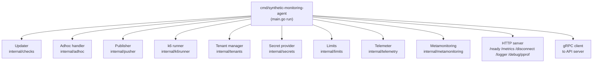

# Glue / bootstrap — `cmd/synthetic-monitoring-agent`

## Purpose

The `synthetic-monitoring-agent` binary is the **glue**: it parses flags,
constructs all top-level components in the right order, wires them
together via plain field injection on option structs, and runs them as
goroutines under a single `errgroup.Group`. There is no other place that
knows how the agent is assembled — every component takes its
collaborators as inputs.

If you are looking for "where does X come from?" or "what gets started at
boot?", this is the doc.

## Where it lives

`cmd/synthetic-monitoring-agent/`

| File         | Responsibility                                                                  |
| ------------ | ------------------------------------------------------------------------------- |
| `main.go`    | Flag parsing, bootstrap sequence (`run()`), `signalHandler()` for SIGTERM, cache setup, GOMEMLIMIT auto-tuning. |
| `grpc.go`    | `dialAPIServer()` — bearer-token credentials, TLS, gRPC keep-alive parameters.  |
| `http.go`    | HTTP `Mux`, readiness handler, `/disconnect` (sends SIGUSR1), `/logger` runtime log-level toggle, optional `/debug/pprof/*`. |
| `flags.go`   | `StringList` custom flag type (comma-separated values).                         |
| `metrics.go` | `registerMetrics()` — build-info, Go runtime, process collectors.               |
| `secret.go`  | `Secret` string type that renders as `"<redacted>"` when logged.                |

## How it fits in

## Bootstrap sequence

The single entry point is `run()` in `main.go`. The sequence below mirrors
the actual order in that function — keep it in sync if you reorder
anything.

1. **Parse flags** into a single `config` struct (`main.go` ~lines 60–138). `-dev` enables several debug toggles at once. `-features` accepts a comma-separated feature-flag list.
2. **Resolve the API token**: command line → `SM_AGENT_API_TOKEN` → `API_TOKEN`.
3. **Set GOMEMLIMIT** based on cgroup/system memory if `-enable-auto-memlimit` is on (default). Implemented via `setupGoMemLimit()`.
4. **Build the root `errgroup.Group`** from a cancellable context. Every long-running task is registered with `g.Go(...)`; `g.Wait()` at the end of `run()` is the agent's lifetime.
5. **Initialise logging** (`zerolog`) — debug/verbose/default levels route to global `zerolog.SetGlobalLevel(...)`.
6. **Install SIGTERM handler** (`signalHandler()`). Note this only handles `SIGINT` and `SIGTERM`; SIGUSR1 is installed *inside* the Updater (see [updater.md](updater.md)).
7. **Build the usage reporter** (`internal/usage`) — HTTP to `stats.grafana.com` unless `-disable-usage-reports`.
8. **Register standard Prometheus collectors** via `registerMetrics()`.
9. **Set up the cache** (`setupCache()`): auto mode picks memcached if `-memcached-servers` is non-empty, otherwise local; can be forced to `noop`. Falls back gracefully on errors.
10. **Create the readiness handler** (`NewReadynessHandler()`). The Updater calls `Set(true)` once it has registered with the API; the handler is wired into `/ready`.
11. **Build the HTTP mux** (`NewMux()`) and start the HTTP server. The server is shut down via a separate `g.Go` that waits on `ctx.Done()` and calls `Shutdown` with a 5-second timeout.
12. **Dial the API server** (`dialAPIServer()` in `grpc.go`). Uses bearer-token credentials and gRPC keep-alive set to `synthetic_monitoring.HealthCheckInterval` / `HealthCheckTimeout`.
13. **Build the k6 runner** if the `k6` feature is set (it is, by default, unless `-disable-k6`). Validates `-blocked-nets` as a CIDR.
14. **Build the tenant manager**, **publisher** (selected by `-publisher`; v2 is the default), **limits**, **secret provider**, **cost attribution labels**, and **telemeter**.
15. **Spawn the Updater**: `checks.NewUpdater(...)` + `g.Go(updater.Run)`.
16. **Spawn the Adhoc handler**: `adhoc.NewHandler(...)` + `g.Go(handler.Run)`.
17. **Spawn metamonitoring** if `-experimental-push-telemetry` is set.
18. **Spawn the k6 versions handler** if a k6 runner exists.
19. **Block on `g.Wait()`**.

### Connection back-off

`newConnectionBackoff()` (`main.go`) returns the `*backoff.Backoff` shared
by both the Updater and the Adhoc handler: 2s → 30s in ~8 steps, with
jitter. If you tune reconnect behaviour, this is the knob.

## HTTP endpoints

All registered in `NewMux()` (`http.go`):

| Path              | Purpose                                                     | Gated by                        |
| ----------------- | ----------------------------------------------------------- | ------------------------------- |
| `/`               | Returns "hello, world!". 404 for any other path.            | always on                       |
| `/metrics`        | Prometheus scrape endpoint, instrumented.                   | always on                       |
| `/ready`          | 200 once the Updater has connected at least once; otherwise 503. | always on                       |
| `/logger`         | `POST debug` / `POST default` to change the log level at runtime. | `-enable-change-log-level` |
| `/disconnect`     | Sends `SIGUSR1` to the agent process (see `disconnectHandler` in `http.go`). | `-enable-disconnect`        |
| `/debug/pprof/*`  | Standard `net/http/pprof` profiling handlers.               | `-enable-pprof`                 |

`-dev` flips on all four optional toggles at once.

The mux also publishes HTTP metrics (`http_requests_duration_seconds`,
`http_requests_written_bytes`, `http_requests_in_flight`) via
`httpsnoop.CaptureMetrics`.

## Signal handling

Two signals matter to the agent, and they are wired up in two different
places:

- **`SIGINT` / `SIGTERM` → graceful shutdown.** Installed by `signalHandler()` in `main.go`. On signal, it returns an error from its `errgroup` goroutine, which cancels the shared context and unwinds every other goroutine.
- **`SIGUSR1` → temporary API disconnect ("handover").** Installed *inside* the Updater's connect loop by `installSignalHandler()` in `internal/checks/checks.go`. The handler closes the gRPC stream context but leaves scrapers running. The Updater then waits the back-off before reconnecting; this gives a replacement agent a window to connect and pick up the probe. See [updater.md](updater.md) for the lifecycle.

`POST /disconnect` is a thin wrapper around `os.FindProcess(os.Getpid())
.Signal(syscall.SIGUSR1)` (`disconnectHandler` in `http.go`).

## Dependency injection conventions

Top-level components do **not** import each other for construction.
Everything is built in `run()` and passed in as fields of an `Opts`
struct. The Updater's `UpdaterOptions` (`internal/checks/checks.go`) is
the canonical example: every collaborator (`Conn`, `Logger`, `Publisher`,
`TenantCh`, `ProbeCh`, `IsConnected` callback, `K6Runner`,
`ScraperFactory`, ...) is a field. The Adhoc handler follows the same
pattern with `adhoc.HandlerOpts`.

Two channels are created in `run()` and shared:

- `tenantCh chan synthetic_monitoring.Tenant` — both the Updater and the Adhoc handler push tenant changes into this channel; the tenant manager consumes it.
- `probeCh chan *synthetic_monitoring.Probe` (buffer 1) — the Updater sends the probe identity into this channel exactly once (`notifyProbeTenant`); metamonitoring consumes it to learn which tenant owns this probe.

If you add a new top-level component, follow the same pattern: define an
`Opts` struct, do all wiring in `run()`, and register the goroutine with
`g.Go(...)`.

## Design details

- **Lifetime ordering.** The HTTP server is started before the gRPC connection so `/ready` and `/metrics` are reachable during initial registration. Components that depend on the gRPC connection (Updater, Adhoc, telemeter, k6versions) are constructed after `dialAPIServer`.
- **Readiness.** `readynessHandler` is a named type `int32`; used as `*readynessHandler`. The Updater calls `Set(true)` once it has registered with the API (see `Updater.loop` in `internal/checks/checks.go`). It never goes back to unready — the agent is either freshly started or it is ready.
- **`Secret` for the API token.** `Secret.MarshalText` returns `"<redacted>"` so the config struct can be safely logged (`zl.Info().Interface("config", config)`).
- **gRPC keep-alive.** Tuned via `HealthCheckInterval` / `HealthCheckTimeout` defined in the protobuf package. Required to detect network failures absent client writes — without it, the agent hangs when the server disappears mid-call.
- **Cache fallbacks.** `setupCache` and `setupLocalCache` log and fall back rather than failing — the agent will boot with a noop cache if everything else fails. This is intentional: caching is a load-shedding optimisation, not a correctness requirement.
- **The `k6` and `traceroute` feature flags are deprecated.** They are permanently enabled. `notifyAboutDeprecatedFeatureFlags` logs a hint if someone still passes them on the command line.

## Testing strategy

`cmd/synthetic-monitoring-agent` carries only unit tests — there is no
end-to-end test of `run()` itself. The tests cover the small leaf pieces:

- `flags_test.go` — `StringList.Set` parsing and trimming.
- `http_test.go` — the `readynessHandler` state machine and the `loggerHandler` request validation.
- `secret_test.go` — `Secret.String` and `Secret.MarshalText` redaction.

Bootstrap behaviour is exercised indirectly: each top-level component has
its own tests under `internal/...` that drive it with mock collaborators
matching the shape of the `Opts` struct.

If you add a new branch in `run()` (a flag, a feature toggle, a new
goroutine), prefer adding a focused unit test next to the new helper
rather than trying to test `run()` itself.

## Other binaries

`cmd/` contains two additional binaries that are *not* part of the
running agent:

- `cmd/synthetic-monitoring-proto` — small utility for manipulating serialised check protobufs.
- `cmd/test-api` — mock gRPC API server used during local development.

Document them separately if they grow.

## When to update this doc

Update this document when you:

- Add, remove, or reorder steps in `run()` in `main.go`.
- Add or remove a top-level component constructed in `run()`.
- Add or remove a command-line flag or environment variable consumed by `run()`.
- Add or remove an HTTP route in `NewMux()` (`http.go`).
- Change the connection back-off parameters in `newConnectionBackoff()`.
- Change `SIGTERM` or `SIGUSR1` handling in `main.go` or `http.go`.
- Change the readiness contract (`readynessHandler.Set` / `ServeHTTP`).
- Add or remove an inter-component channel shared at boot.
- Modify the cache setup or fallback logic in `setupCache` / `setupLocalCache`.
