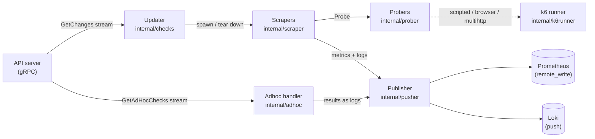

# Synthetic Monitoring agent — architecture documentation

This directory describes how the Synthetic Monitoring agent is put together.
Read it once to build a mental model; come back to specific component docs
when you change code in that area.

## What the agent does

The agent is a distributed probe. It connects to a central API server,
receives a list of checks to run (HTTP, DNS, TCP, ICMP, gRPC, Traceroute,
and k6-based scripted/browser/multihttp checks), executes them on schedule,
and publishes results as Prometheus metrics and Loki log lines.

## Top-level data flow

## Reader's guide

| If you want to…                                          | Start with                                  |
| -------------------------------------------------------- | ------------------------------------------- |
| Understand startup, flags, signals, dependency wiring    | [cmd.md](cmd.md)  |
| Trace how a check arrives from the API and starts running | [updater.md](updater.md) |
| Split checks across a fleet of agents (clustering)       | [cluster.md](cluster.md) |
| Understand how a single check gets executed on schedule  | [scraper.md](scraper.md) |
| Add a new check type or modify an existing prober        | [prober.md](prober.md) |
| Touch scripted / browser / multihttp execution           | [k6runner.md](k6runner.md) |
| Modify how metrics and logs are shipped out              | [publisher.md](publisher.md) |
| Work on the "test this check now" UI flow                | [adhoc.md](adhoc.md) |

## Component index

- **[Glue / bootstrap](cmd.md)** — `cmd/synthetic-monitoring-agent/`. Wires every other component together; owns flag parsing, the HTTP server, the gRPC connection, signal handling.
- **[Updater](updater.md)** — `internal/checks`. Holds the long-lived `GetChanges()` stream; owns the lifecycle of every scraper.
- **[Scraper](scraper.md)** — `internal/scraper`. One per active check; runs the prober on schedule, decorates output, manages metric lifecycle.
- **[Prober](prober.md)** — `internal/prober`. Per-check-type implementations (HTTP, DNS, TCP, ICMP, gRPC, Traceroute, plus k6-backed scripted/browser/multihttp).
- **[k6 runner](k6runner.md)** — `internal/k6runner`. Runs k6 scripts either as a local subprocess or via a remote HTTP runner.
- **[Publisher](publisher.md)** — `internal/pusher`. Per-tenant push handlers; batches and ships to Prometheus and Loki.
- **[Adhoc handler](adhoc.md)** — `internal/adhoc`. Separate gRPC stream for on-demand "test this check now" runs.
- **[Clustering](cluster.md)** — `internal/cluster`. Optional gossip ring (`grafana/ckit`) that splits check ownership across a fleet of agents (RF=1). Off by default. Consumed by the Updater via the `Node` interface.

## Supporting components (follow-up docs)

These packages are real architectural components but are not documented in
this initial pass. They each warrant a dedicated doc later.

- `internal/tenants` — Tenant metadata cache (TTL with jitter; per-tenant locks). Provides auth context to the publisher. *TODO: dedicated doc.*
- `internal/secrets` — Remote secret store integration; fetches credentials for checks. *TODO: dedicated doc.*
- `internal/limits` — Per-tenant quota and label-cardinality enforcement. *TODO: dedicated doc.*
- `internal/cache` — Pluggable cache (memcached / local / no-op) used to shed load from upstream APIs. *TODO: dedicated doc.*
- `internal/telemetry` — Region-level telemetry pushed to an internal backend. *TODO: dedicated doc.*
- `internal/usage` — Anonymous usage reporting to `stats.grafana.com`. *TODO: dedicated doc.*
- `internal/metamonitoring` — Publishes the agent's own internal metrics as a synthetic check. *TODO: dedicated doc.*
- `internal/k6version` — k6 version resolution and caching, used by k6runner. *TODO: dedicated doc (or fold into k6runner).*
- `internal/feature` — Feature-flag plumbing. *Likely too small for a dedicated doc; revisit.*
- `internal/cals` — Cost-attribution labels for Loki streams. *Likely too small for a dedicated doc; revisit.*

## Other binaries

- `cmd/synthetic-monitoring-proto` — Small utility for manipulating serialized check protobufs. Not part of the running agent.
- `cmd/test-api` — Mock gRPC server used during development. Not part of the running agent.

## Cross-cutting concerns

### Error classification

Two custom error types in `internal/error_types` control how the agent
reacts to failures:

- `FatalError` — stop the affected component (e.g. unauthorised probe, incompatible API).
- `TransientError` — retry with back-off (e.g. transport closing, gRPC `Unavailable`).

Wrapping is done with `fmt.Errorf("...: %w", err)` and unwrapping with
`errors.As` / `errors.Is`. The Updater's `handleError`
(`internal/checks/checks.go`) is the canonical switch — copy that shape
when adding a new long-lived loop.

### Tenant isolation

Every payload is tagged with a tenant ID. The publisher maintains separate
push handlers per tenant. Secrets are stored remotely, not in the agent.
See `internal/tenants` and `internal/secrets`.

### Metric lifecycle

The agent goes out of its way to give Prometheus a clean view of check
results:

- **Stale markers** — when a scraper shuts down, it emits NaN values so Prometheus knows the series ended.
- **Republishing** — for checks with an interval longer than ~2 minutes, the scraper resends the most recent values with updated timestamps so the series doesn't go stale between probes.
- **`sm_check_info`** — a special metric carrying check metadata (geohash, frequency, alert sensitivity) for use in joins.

See [scraper.md](scraper.md) for the details.

### Signals

- `SIGINT` / `SIGTERM` — graceful shutdown.
- `SIGUSR1` (or `POST /disconnect`) — disconnect from the API but keep running checks; allows another agent to take over for zero-downtime upgrades. If no other agent connects within ~1 minute, the disconnected agent reconnects.

Implemented in `cmd/synthetic-monitoring-agent/main.go` and
`cmd/synthetic-monitoring-agent/http.go`. See
[cmd.md](cmd.md).

### Testing

Each component doc carries a **Testing strategy** section. A few
cross-cutting points worth knowing up front:

- **Run everything**: `make test` (Docker, race detector enabled, `CGO_ENABLED=1`, coverage).
- **Fast subset**: `make test-fast` (adds `-short`, skips slower integration / timer-based tests).
- **One package**: `make test-go GO_TEST_ARGS=./internal/<pkg>/...`. Hand it any `go test` flags via `GO_TEST_ARGS`.
- **Mocks are rare**. The conventions are dependency injection with real types, in-process `httptest.Server` for HTTP endpoints, and an in-process gRPC server when one is needed. Where mocks exist they're named `Mock*` or `Fake*`.
- **Test helpers** live in `internal/testhelper` — `Context`, `Logger`, `K6Paths`, mock secret stores, etc. Use these instead of rolling your own.
- **Golden files**: `internal/scraper/testdata/*.txt` holds end-to-end Prometheus output expectations per check type (regenerate with `-update-golden`); `internal/k6runner/testdata/` holds a fake k6 binary plus golden script/output/log pairs.
- **Code-generation discrepancy tests**: `pkg/pb/synthetic_monitoring/multihttp_string_test.go` pins the protobuf enum ↔ string mapping, and `pkg/accounting/accounting_test.go` ensures every check type has an accounting entry.
- **Linting**: `make lint` runs `golangci-lint` v2 in Docker, plus `go vet` and `shellcheck`. Custom rules live in `internal/rules/rules.go` (ruleguard).

## Keeping these docs current

Each component doc ends with a **When to update this doc** checklist. Use
that as the source of truth when you change code. The table below is a
quick index from "I changed code under X" to "I should update doc Y".

| If you change…                                          | Update                              |
| ------------------------------------------------------- | ----------------------------------- |
| `cmd/synthetic-monitoring-agent/*`                      | `cmd.md`               |
| `internal/checks/*`                                     | `updater.md`           |
| `internal/scraper/*`                                    | `scraper.md`           |
| `internal/prober/*` (any subdir)                        | `prober.md`            |
| `internal/k6runner/*`, `internal/k6version/*`           | `k6runner.md`          |
| `internal/pusher/*`, `internal/pkg/{prom,loki}/*`       | `publisher.md`         |
| `internal/adhoc/*`                                      | `adhoc.md`             |
| `internal/cluster/*`                                    | `cluster.md`           |
| Top-level data flow or any new cross-component pathway  | this file                           |
| Add a new gRPC RPC                                      | the doc for the component that owns it |
| Add a new check type                                    | `prober.md` (+ `k6runner.md` if k6-backed) |

If you find yourself changing code that isn't well-represented in any doc,
either (a) extend the relevant doc, or (b) move one of the *follow-up*
components above into its own dedicated doc.
