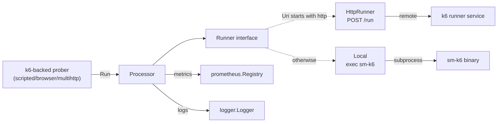

# k6 runner — `internal/k6runner`

## Purpose

The k6 runner is how the agent executes scripted, browser, and MultiHTTP
checks. It abstracts two very different execution models behind a single
`Runner` interface:

- **Local** — spawn the `sm-k6` binary as a subprocess. Used in default standalone deployments.
- **HTTP** — POST the script to a remote runner service. Used in managed deployments where execution is centralised.

It also owns the *output parser* that turns k6's Prometheus-format
metrics and logfmt logs back into a `prometheus.Registry` and a
`logger.Logger` — the same shape probers use elsewhere.

## Where it lives

`internal/k6runner/`

| File                | Responsibility                                                                |
| ------------------- | ----------------------------------------------------------------------------- |
| `k6runner.go`       | `Runner` interface, factory (`New`), `Processor` (output parsing).            |
| `local.go`          | `Local` runner — temp dir + subprocess.                                       |
| `http.go`           | `HttpRunner` — POST to remote, retry/back-off, HTTP metrics.                  |
| `env.go`            | k6 command-line environment construction.                                     |
| `error.go`          | Error-code mapping (`ErrorCodeFailed`, `ErrorCodeTimeout`, etc.).             |
| `version/`          | k6 version repository — resolves a channel manifest (semver) to an installed binary. See also `internal/k6version`. |
| `testdata/`         | Fake k6 binary, golden script/output/log files.                               |

## How it fits in



## The `Runner` interface

```go
type Runner interface {
    WithLogger(logger *zerolog.Logger) Runner
    Run(ctx context.Context, script Script, secretStore SecretStore) (*RunResponse, error)
    Versions(context.Context) <-chan []string
}
```

- `WithLogger` returns a *copy* so per-check logging doesn't pollute the shared runner state.
- `Run` is one execution. The `Script` carries the bytes, settings (including `Timeout`), `CheckInfo` metadata, and a `K6ChannelManifest` semver constraint for binary selection.
- `Versions` returns a channel of supported k6 versions. Local pushes once and closes; HTTP polls the remote runner every `versionPollInterval` (30s default). Consumed by `internal/k6version`.

`SecretStore` is a `{Url, Token}` pair. If both are set, the runner
exposes a secret-store URL+token configuration to the k6 process so
scripts can fetch credentials via the Synthetic Monitoring k6 extension.

### Selection

`New(RunnerOpts)` (in `k6runner.go`):

- `Uri` starts with `http` → `HttpRunner` (the path is treated as a base URL; the runner appends `/run`). Trailing `/run` is stripped for backwards compatibility.
- otherwise → `Local`. `Repository` is the directory containing `sm-k6` binaries (default `/usr/libexec/sm-k6`).

The `cmd/synthetic-monitoring-agent` flags `-k6-uri`, `-k6-repository`,
and `-disable-k6` control this from outside. `-disable-k6` short-circuits
runner construction entirely (the k6 feature flag is cleared and
k6-backed probers refuse to build).

## Local execution

`Local.Run` (`local.go`):

1. Resolve the k6 binary via `version.Repository.Resolve(manifest)`. If the script doesn't carry a manifest, falls back to `*` (latest).
2. Apply the per-check `Timeout` as a context timeout (`ErrNoTimeout` if zero).
3. Create a temp workdir; write the script, an empty metrics file, an empty logs file, and (if the secret store is configured) a JSON config file referencing the secret store URL+token.
4. Build the k6 command line via `env.go` — flags for prometheus metrics output, logfmt logs, and the blocked-CIDR list (from `-blocked-nets`).
5. Run the subprocess; capture stdout/stderr to the logger for debugging.
6. Read the metrics and logs files back as raw bytes; wrap them in a `RunResponse` along with an error code derived from the process exit status (see `error.go`).

The temp directory is removed via `defer`; if cleanup fails the error
is logged with `severity=critical`.

## HTTP execution

`HttpRunner.Run` (`http.go`):

1. Refuse a zero `backoff` (panic — misconfigured runner).
2. Set a deadline if the parent context has none — default is twice the script timeout. This bounds the *total* time across all retries; *one* attempt is bounded by `checkTimeout + graceTime` (default grace = 20s).
3. Loop: POST `HTTPRunRequest{Script, SecretStore, NotAfter}` to `<url>/run`. `NotAfter` tells the remote runner the absolute deadline so it can refuse late requests.
4. Treat the response by status code (see `request`):
   - `200 / 408 / 422 / 500` — machine-readable response; parse a `RunResponse` (may contain `Error`/`ErrorCode`).
   - `400` — non-retryable, returns `ErrUnexpectedStatus`.
   - anything else — assume infra (ingress, k8s, ...) and mark as retryable.
5. Any transport-level error (network, TLS, ...) is retryable.
6. Between retries: linear back-off plus jitter. Each wait is shortened by the time already spent in the request, on the assumption that the most common retryable error is a timeout — so we don't double-wait.
7. Returns when the context deadline is reached or a non-retryable error fires.

The runner publishes its own metrics (`HTTPMetrics`):

- `Requests{success, retriable}` counters
- `RequestsPerRun{success}` histogram

These are namespaced by the `prometheus.Registerer` passed to `New`.

## Output processing (`Processor`)

`Processor.Run` (`k6runner.go`):

1. Get a logger-bound runner via `runner.WithLogger(internalLogger)`.
2. Call `runner.Run`; on error return early.
3. Validate runner output — if exactly one of `Error` / `ErrorCode` is set, return `ErrBuggyRunner`.
4. If `ErrorCode` is set, emit a deferred log line with the failure diagnostic.
5. Pipe `result.Logs` through `k6LogsToLogger` (logfmt → `logger.Logger`). Lines with `level=debug` and no `source` are dropped — they're k6 noise.
6. Decode `result.Metrics` (Prometheus text format) via `extractMetricSamples`. Three collectors share the stream:
   - `sampleCollector` — every metric becomes a `prometheus.Metric` in a `customCollector`. The collector emits *unchecked* metrics (`Describe` is empty) so identically-named metrics with different label sets coexist.
   - `checkResultCollector` — watches `probe_checks_total{result="fail"}`; sets `failure=true` if the count is non-zero.
   - `probeDurationCollector` — extracts `probe_script_duration_seconds` for the scraper's `patchDuration` fix-up.
7. Register the `sampleCollector` in the supplied `prometheus.Registry`.
8. Map the `ErrorCode` to a return value:
   - `""` → success.
   - `timeout`, `killed`, `user`, `failed`, `aborted` → user failure (`success=false`, no error returned).
   - anything else → wrapped `ErrFromRunner`.

`"user"` is a legacy alias for `"aborted"` kept until the remote
runner stops emitting it.

## Error codes

Defined in `error.go`. Both runners produce them, and the
`errorType(err)` helper maps Go errors to the string codes:

| Code        | Cause                                                                |
| ----------- | -------------------------------------------------------------------- |
| `""`        | Success.                                                             |
| `failed`    | k6 threw an uncaught exception, or `fail()` / threshold breach.      |
| `timeout`   | Context deadline exceeded (the per-script timeout).                  |
| `killed`    | Process killed by signal (exit code ≥ 128, including OOM-kill).      |
| `aborted`   | k6 fatal — config error, syntax error, stacktrace, etc.              |
| `unknown`   | Anything we cannot classify. Logged at error level.                  |

`isUserError(err)` decides whether to *attribute* a failure to the
user (script/settings) vs the runner. `errorFromLogs(logs)` peeks at
the k6 logs for stacktrace/uncaught-exception markers to refine
classification when the exit code alone isn't enough.

## Secret-store integration

When `SecretStore.IsConfigured()` (`Url` and `Token` both non-empty):

- Local: writes a JSON config file with the URL+token and passes `--config <file>` to k6.
- HTTP: includes the `SecretStore` directly in the request body.

The k6 process loads the synthetic-monitoring extension which uses
these to fetch named secrets at script execution time.

If the store is not configured, the runner logs a warning and lets the
script proceed — useful for development, but checks that reference
secrets will fail.

## Key types and entry points

| Type / function                       | File          | Notes                                                  |
| ------------------------------------- | ------------- | ------------------------------------------------------ |
| `Runner` (interface)                  | `k6runner.go` | The contract.                                          |
| `New(RunnerOpts)`                     | `k6runner.go` | Picks `Local` vs `HttpRunner` from `Uri`.              |
| `Processor`, `(*Processor).Run(...)`  | `k6runner.go` | Output parser; called by the k6-backed probers.        |
| `Script`, `Settings`, `CheckInfo`     | `k6runner.go` | Request payload.                                       |
| `RunResponse`                         | `http.go`     | Common response (metrics + logs + error code).         |
| `Local`                               | `local.go`    | Subprocess implementation.                             |
| `HttpRunner`                          | `http.go`     | Remote-service implementation.                         |
| `errorType(err)`, `isUserError(err)`  | `error.go`    | Error classification.                                  |
| `version.Repository`                  | `version/`    | Maps a k6 channel manifest (semver) to an installed binary. |

## Testing strategy

- **Table-driven** unit tests across `k6runner_test.go`, `local_test.go`, `http_test.go`, `error_test.go`, `env_test.go`.
- `testdata/k6-fake` is a deterministic fake binary used by Local tests to avoid invoking real k6. It writes pre-baked metrics and logs based on its arguments.
- `testdata/test.js`, `testdata/test.out`, `testdata/test.log` are golden script/output/log files for output-parser tests.
- HTTP runner tests use `httptest.Server` to stand in for the remote service; they exercise both the happy path and the retry/back-off branches.
- Some tests are gated by `testing.Short()` because they exercise the back-off timer.

Run just this package:

```bash
make test-go GO_TEST_ARGS=./internal/k6runner/...
```

If you change command-line flags passed to k6 (in `env.go`), make
sure `local_test.go` still asserts the expected argv shape.

## When to update this doc

Update this document when you:

- Add or remove a method on the `Runner` interface.
- Add a new runner implementation (e.g. an in-process k6 host).
- Change the runner-selection logic in `New(RunnerOpts)`.
- Change the request/response shape (`HTTPRunRequest`, `RunResponse`).
- Change the retry / back-off / grace-time behaviour in `HttpRunner`.
- Add or rename an error code in `error.go`.
- Change the secret-store wiring (config file format, request body).
- Touch the `k6-fake` testdata in a way that changes its observable output.
- Change the metrics published under `HTTPMetrics`.
- Add new flags to the k6 invocation (`env.go`).
