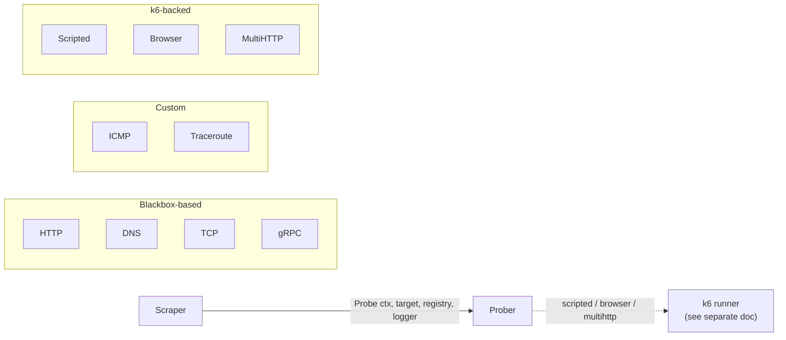

# Probers — `internal/prober`

## Purpose

A Prober executes a single check of a given type. The package exposes a
single `Prober` interface and a factory that picks the right
implementation per check type. Each implementation either wraps a
`blackbox_exporter` module, runs a custom probe (ICMP, Traceroute), or
delegates to the [k6 runner](k6runner.md) for
scripted/browser/multihttp checks.

## Where it lives

`internal/prober/` plus one subpackage per check type:

| Path                                | Check type / role                                            |
| ----------------------------------- | ------------------------------------------------------------ |
| `prober.go`                         | `Prober` interface, `ProberFactory`, type dispatch.          |
| `http/`                             | HTTP — wraps `blackbox_exporter/prober`.                     |
| `dns/`                              | DNS — uses an in-tree fork (`dns/internal/bbe`) of the upstream blackbox-exporter DNS prober due to an unmerged upstream PR. Has an experimental implementation gated on `feature.ExperimentalDnsProber`. |
| `tcp/`                              | TCP — wraps `blackbox_exporter/prober`.                      |
| `grpc/`                             | gRPC — wraps `blackbox_exporter/prober`.                     |
| `icmp/`                             | ICMP — custom implementation (`icmp_impl.go` + `utils.go`).  |
| `traceroute/`                       | Traceroute — custom implementation.                          |
| `scripted/`                         | k6-backed scripted check.                                    |
| `browser/`                          | k6-backed browser check.                                     |
| `multihttp/`                        | k6-backed MultiHTTP; generates a k6 script from assertions (`script.go`, `script.tmpl`). |
| `interpolation/`                    | Helpers for substituting check-config values into request payloads (used by MultiHTTP). |
| `logger/`                           | The `logger.Logger` interface the prober contract uses to emit log lines. |

## How it fits in



## The `Prober` interface

```go
type Prober interface {
    Name() string
    Probe(ctx context.Context, target string, registry *prometheus.Registry, logger logger.Logger) (bool, float64)
}
```

Contract:

- `Name()` returns the check-type string (used in metric labels and logs).
- `Probe(...)` runs *one* probe. It registers all of its metrics in the caller-supplied `prometheus.Registry`, emits log lines via the caller-supplied `logger.Logger`, and returns `(success, duration)`.
- The registry is fresh per-probe (created by `scraper.getProbeMetrics`) — implementations don't have to worry about deduplication or cleanup.
- The function `prober.Run(...)` is a convenience that just calls `p.Probe(...)`. Use it if you don't already have a Prober reference.

## The `ProberFactory`

```go
type ProberFactory interface {
    New(ctx context.Context, logger zerolog.Logger, check model.Check) (Prober, string, error)
}
```

Returns `(prober, target, error)`. The `target` is the address the
scraper logs and exposes as the `instance` label — for most check types
that's `check.Target`, but for DNS it's the DNS server address
(`check.Settings.Dns.Server`), since the check.Target itself is the
*name being looked up*.

`NewProberFactory` (in `prober.go`) is constructed with the k6 runner,
the probe ID (used to inject the `x-sm-id` request header for HTTP /
MultiHTTP — see `getReservedHeaders`), the feature collection, and the
secret provider.

### Type dispatch

Defined in `proberFactory.New` (`prober.go`):

| `sm.CheckType_*`     | Implementation                                                |
| -------------------- | ------------------------------------------------------------- |
| `CheckTypePing`      | `icmp.NewProber(check)`                                       |
| `CheckTypeHttp`      | `httpProber.NewProber(ctx, check, logger, reservedHeaders, secretStore)` |
| `CheckTypeDns`       | `dns.NewProber(check)` (or `dns.NewExperimentalProber` if `feature.ExperimentalDnsProber` is set) |
| `CheckTypeTcp`       | `tcp.NewProber(ctx, check, logger)`                           |
| `CheckTypeTraceroute`| `traceroute.NewProber(check, logger)`                         |
| `CheckTypeScripted`  | `scripted.NewProber(ctx, check, logger, runner, secretStore)` — requires k6 runner. |
| `CheckTypeBrowser`   | `browser.NewProber(ctx, check, logger, runner, secretStore)` — requires k6 runner. |
| `CheckTypeMultiHttp` | `multihttp.NewProber(ctx, check, logger, runner, reservedHeaders, secretStore)` — requires k6 runner. |
| `CheckTypeGrpc`      | `grpc.NewProber(ctx, check, logger)`                          |
| (anything else)      | `errUnsupportedCheckType`                                     |

If you add a new check type, this is the *only* place the agent learns
about it — but you also need to wire it through `internal/checks`
(feature gating) and `internal/scraper` (timeout selection,
`sm_check_info` labels if relevant).

### Reserved headers

`getReservedHeaders` injects the `x-sm-id` request header for HTTP and
MultiHTTP checks. The header carries `"<globalCheckID>-<probeId>"` so
upstream services can correlate requests with check executions. If
`probeId == 0` (the test path, or before registration), nothing is
injected.

## Implementation families

### Blackbox-based (`http`, `dns`, `tcp`, `grpc`)

These wrap `github.com/prometheus/blackbox_exporter/prober`. The
per-type file translates the SM `Check` configuration into a
blackbox-exporter `config.Module` and calls the upstream
`ProbeHTTP` / `ProbeDNS` / `ProbeTCP` / `ProbeGRPC` function.

DNS is special: the project keeps an in-tree fork at
`prober/dns/internal/bbe` because the upstream DNS prober is missing a
behaviour change (see the PR link in `dns/internal/bbe/prober/dns.go`).
The fork is intentionally narrow — keep it in sync with upstream when
practical.

### Custom (`icmp`, `traceroute`)

These implement the same interface but do not call into
blackbox-exporter. They emit the same general shape of metrics
(`probe_success`, `probe_duration_seconds`, plus type-specific gauges)
so the rest of the pipeline doesn't need to know they are custom.

ICMP splits across `icmp.go` and `icmp_impl.go` so the noisy raw-socket
work stays in one place.

### k6-backed (`scripted`, `browser`, `multihttp`)

These three are thin shells around the k6 runner. See
[k6runner.md](k6runner.md) for everything
about k6 execution and output parsing. The relevant per-prober
responsibility is *script preparation*:

- **scripted**: the user supplies the script verbatim.
- **browser**: a small wrapper script around the user's browser-test code.
- **multihttp**: the user supplies a *list of HTTP requests* with assertions; `multihttp/script.go` renders a k6 script from `script.tmpl` plus optional `interpolation/` substitutions. If you change the rendered script, update the golden tests in `multihttp/script_test.go`.

## Design details

- **Per-probe Prometheus registry**: the scraper hands a *fresh* `prometheus.Registry` to every probe. This is what lets all probers register metrics with stable names (`probe_*`) without colliding across check runs.
- **Logging via `logger.Logger`**: probers don't see Loki directly. They get a `logger.Logger` (a thin adapter around `go-kit/kit/log`) that the scraper has decorated with all the necessary labels. Anything written to it becomes a log line on the check's stream.
- **Capabilities**: the API can disable scripted or browser support per probe (`Probe_Capabilities`). The Updater enforces capability validation against the available k6 runner; the prober factory itself just refuses to construct k6-backed probers when no runner is configured.
- **Context lifetime**: the context handed to `New(...)` for k6-backed probers is the *scraper's* context (cancelled when the scraper is destroyed). The context handed to `Probe(...)` is the *per-probe* context with the timeout already applied.

## Testing strategy

- **Table-driven** unit tests sit next to each implementation (`<type>_test.go`).
- HTTP uses `internal/prober/http/testserver` to spin up a real local HTTP server with a fixed handler set.
- DNS uses `github.com/miekg/dns` for an in-process DNS server.
- MultiHTTP has both behavioural tests (`multihttp_test.go`) and script-generation tests (`script_test.go`) — the latter verify the rendered k6 script byte-for-byte.
- k6-backed prober tests use the fake k6 binary at `internal/k6runner/testdata/k6-fake`, so no real k6 process is needed.
- The factory itself has `prober_test.go` covering each `case` in the dispatch.

End-to-end metric expectations are pinned by the **scraper** golden
files (`internal/scraper/testdata/*.txt`), not by the prober tests
themselves. If you change emitted metrics, regenerate those goldens.

Run a single prober's tests:

```bash
make test-go GO_TEST_ARGS=./internal/prober/http/...
```

## When to update this doc

Update this document when you:

- Add a new `case` in `proberFactory.New` (i.e. a new check type).
- Change the `Prober` interface signature.
- Change what `target` is returned from the factory for any check type.
- Add or remove a reserved header in `getReservedHeaders`.
- Add or remove a feature flag gating an alternative prober implementation (e.g. `ExperimentalDnsProber`).
- Re-sync the `dns/internal/bbe` fork with upstream `blackbox_exporter`, or move it back to the upstream module.
- Add a new prober subpackage, or change which family a check type belongs to (blackbox-based / custom / k6-backed).
- Change the contract of `logger.Logger` consumed by probers.
