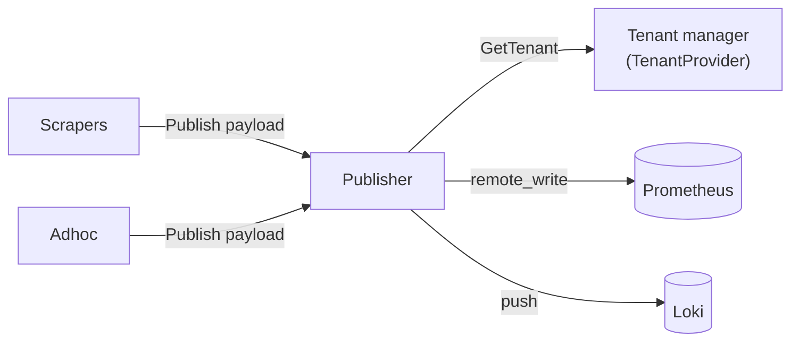
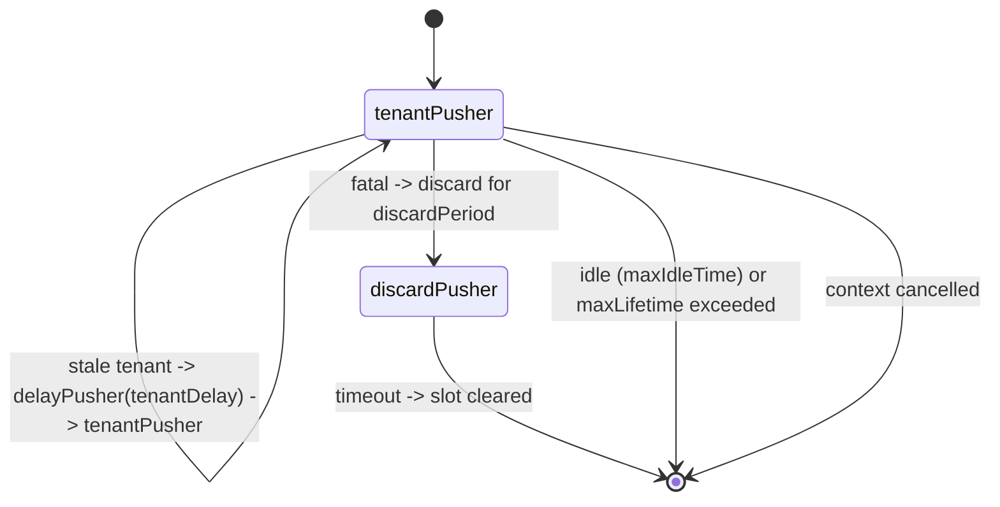

# Publisher — `internal/pusher`

## Purpose

The Publisher accepts payloads from scrapers and the ad-hoc handler and
ships them outward: **metrics via Prometheus remote-write**, **logs via
the Loki push API**. It maintains a separate **push handler per tenant**
so one tenant's backpressure does not block another, and it includes
back-off, retry, idle-cleanup, and "tenant temporarily disabled" paths
that the rest of the agent doesn't have to know about.

## Where it lives

`internal/pusher/`

| File / dir              | Responsibility                                                       |
| ----------------------- | -------------------------------------------------------------------- |
| `pusher.go`             | `Publisher`, `Payload`, `TenantProvider`, `Factory` interfaces.      |
| `registry.go`           | Generic `registry[T]` used to look up implementations by name.       |
| `metrics.go`            | Shared `Metrics` struct (counters/gauges) used by both v1 and v2.    |
| `clients.go`            | `ClientFromRemoteInfo` — turns the API-supplied `RemoteInfo` into a `prom.Client` config. |
| `v1/`                   | Original implementation: one goroutine per `Publish` call. Retained for compatibility; selected by `-publisher v1`. |
| `v2/`                   | Current implementation: per-tenant long-lived handlers with queues, retries, life-cycle. **Default.** |
| `internal/pkg/prom`     | Prometheus remote-write client wrapper.                              |
| `internal/pkg/loki`     | Loki push client wrapper (used by v1; v2 uses `prom.Client` for both because Loki's API is wire-compatible enough). |

## How it fits in



## Public contract

```go
type Payload interface {
    Tenant() model.GlobalID
    Metrics() []prompb.TimeSeries
    Streams() []logproto.Stream
}

type Publisher interface {
    Publish(Payload)
}

type TenantProvider interface {
    GetTenant(context.Context, *sm.TenantInfo) (*sm.Tenant, error)
}

type Factory func(ctx context.Context, tm TenantProvider,
                  logger zerolog.Logger,
                  promRegisterer prometheus.Registerer) Publisher
```

`Publish` is non-blocking and infallible from the caller's point of
view; errors are absorbed and reflected in metrics.

`Factory` is the registration shape. Both implementations register at
import time (in `cmd/synthetic-monitoring-agent/main.go`):

```go
pusherRegistry.MustRegister(pusherV1.Name, pusherV1.NewPublisher)
pusherRegistry.MustRegister(pusherV2.Name, pusherV2.NewPublisher)
```

The `-publisher` flag picks one. v2 (`Name = "v2"`) is the default.

## V1 vs V2

| Aspect                       | v1                                             | v2                                                                 |
| ---------------------------- | ---------------------------------------------- | ------------------------------------------------------------------ |
| Concurrency model            | One goroutine per `Publish` call.              | Long-lived per-tenant goroutine consuming a queue.                 |
| Per-tenant batching          | No.                                            | Yes — batched up to `maxPushBytes` (64 KiB).                       |
| Backpressure handling        | Per-call.                                      | Two queues (metrics, logs), bounded by bytes (`maxQueuedBytes`) and time (`maxQueuedTime`). |
| Tenant lifetime              | n/a (stateless).                               | `maxLifetime` (2h ± 25 % jitter) to force tenant info refresh.     |
| Idle cleanup                 | n/a.                                           | `maxIdleTime` (65 min) — handler exits if no pushes arrive.        |
| Failure modes                | Retried inline.                                | Returned as classified `pushError` → `delayPusher` / `discardPusher`. |
| 429 / "Too Many Requests"    | Standard back-off.                             | Dedicated `waitPeriod` (1 min) during which payloads keep arriving but pushes are paused. |
| Fatal failures               | Returned to the caller.                        | `discardPusher` drops payloads for `discardPeriod` (15 min).       |
| State exposed by metric      | `sm_agent_publisher_*`                         | Same metrics + the v2-only `drop_total`, `responses_total`, `handlers_total`. |

If you are changing publish behaviour, **change v2.** v1 exists for
the rare deployment that pins `-publisher v1`; it should not gain new
features.

## V2 internals

### Top-level — `publisherImpl`

`publisher.go`:

- A single `Publisher` instance, no shared queue.
- `handlers map[model.GlobalID]payloadHandler`, mutex-guarded by `handlerMutex`.
- `Publish` looks up (or creates) the handler for the payload's tenant, then calls `handler.publish(payload)`. Handler creation atomically swaps a `nil` slot for a new `tenantPusher` and spawns a goroutine running `runHandler`.
- `replaceHandler` is the only mutation primitive. The truth-table comment in the source documents every old/current/new combination. Bugs in this area tend to look like "handlers vanish under load"; do not simplify without understanding that table.

### `tenantPusher` — per-tenant state machine

`tenant_pusher.go`:



- `run` fetches the tenant from the `TenantProvider`, derives the Prometheus and Loki remote configs (`tenant.MetricsRemote`, `tenant.EventsRemote`), and starts two queue pushers under an `errgroup`.
- An idle checker and a max-lifetime checker run as additional group members.
- When `run` returns it inspects the error:
  - `nil`, `context.Canceled`, `errTenantIdle` → clear the slot.
  - `pushError` with `errKindWait` → wrap self in a `delayPusher`, re-run after `waitPeriod`.
  - `pushError` with `errKindTenant` → re-run after `tenantDelay` (forces a fresh `GetTenant` call).
  - `pushError` with `errKindFatal` → switch to `discardPusher` for `discardPeriod`.

`delayPusher` and `discardPusher` are degenerate handlers that share
the same `payloadHandler` interface. `delayPusher` forwards `publish`
calls to the inner handler so payloads queue while we sleep;
`discardPusher` increments `DroppedCounter` and drops payloads on the
floor.

### Queues

`queue.go`:

- One `queue` per stream type (metrics, logs).
- Backed by a slice of `queueEntry`. Bytes-based limits; `condition` (a 1-buffered channel) is used to wake the pusher when new data arrives.
- `push` loop:
  - Wait on the condition or `ctx.Done()`.
  - Snapshot the current records (`get`) and stream them to the remote via `prom.Client.StoreStream` over a `newConcatReader` that concatenates the snappy-encoded records (`snappy_concat.go`).
  - Classify the result via `parsePublishError` (`errors.go`):
    - HTTP 200 → success.
    - HTTP 4xx (except 408 / 422) → fatal.
    - HTTP 408, 422, 5xx, network error → retriable.
    - HTTP 429 → returns `errKindWait` to bump the handler to `delayPusher`.
  - On retriable error: requeue and back off (`backoffer.wait` — exponential, capped at `maxBackoff`).

`snappy_concat.go` is a small helper that lets the queue treat a
series of pre-snappy-encoded buffers as a single stream-of-frames
without re-encoding. Don't break the framing without updating both
sides.

### Failure classification

`errors.go` defines `pushError{kind, inner}` and the only three kinds:

- `errKindFatal` — give up entirely (auth, malformed remote URL, unauthorized tenant).
- `errKindTenant` — tenant info likely stale, refresh.
- `errKindWait` — back off but keep accepting payloads.

If you add new branches in the response-classification switch, decide
which kind they belong to *first* — that's what drives all downstream
behaviour.

### Tunables

Defaults live in `options.go` (`defaultPusherOptions`):

| Option              | Default       | Purpose                                            |
| ------------------- | ------------- | -------------------------------------------------- |
| `maxPushBytes`      | 64 KiB        | Cap on a single remote-write request body.         |
| `maxQueuedBytes`    | 1 MiB         | Backpressure ceiling per queue.                    |
| `maxQueuedTime`     | 1 h           | Drop records older than this from the queue.       |
| `maxRetries`        | 50            | Per-batch retry count.                             |
| `minBackoff`/`max`  | 50 ms / 30 s  | Exponential back-off bounds.                       |
| `maxLifetime`       | 2 h ± 25 %    | Force a tenant refresh after this long.            |
| `maxIdleTime`       | 65 min        | Tear down handlers that haven't received pushes.   |
| `tenantDelay`       | 10 s          | Delay between `GetTenant` retries.                 |
| `waitPeriod`        | 1 min         | Back-off after 429.                                |
| `discardPeriod`     | 15 min        | How long fatal errors keep payloads on the floor.  |

These are not currently exposed as flags. If you make them
configurable, do it in one place (`pusherOptions`) and document the
flag in `cmd.md`.

## Metrics

All counters are tagged with `regionID`, `tenantID`, and `type`
(`metrics` or `logs`). See `metrics.go` for the canonical names:

- `sm_agent_publisher_push_total{regionID, tenantID, type}`
- `sm_agent_publisher_push_errors_total{..., status}`
- `sm_agent_publisher_push_failed_total{..., reason}`
- `sm_agent_publisher_push_bytes{...}`
- `sm_agent_publisher_retries_total{...}`
- `sm_agent_publisher_drop_total{...}` *(v2 only — registered for v1 too, but always zero)*
- `sm_agent_publisher_responses_total{..., status}` *(v2 only — registered for v1 too, but always zero)*
- `sm_agent_publisher_handlers_total` *(v2 only — gauge; registered for v1 too, but always zero)*

`Metrics.WithTenant(localID, regionID)` and `WithType(t)` produce
pre-curried sub-vectors so tenant pushers don't pay for label resolution
on every increment.

## Backing clients

- `internal/pkg/prom` — Prometheus remote-write client. Used by both v1 and v2.
- `internal/pkg/loki` — Loki push client. Used by v1. v2 uses the same `prom.Client` for Loki because the wire format is close enough.
- `pusher.ClientFromRemoteInfo(remote)` (`clients.go`) builds a `*prom.ClientConfig` from `sm.RemoteInfo` — appends `/push`, sets the 5s timeout, copies basic-auth credentials, sets `X-Prometheus-Remote-Write-Version: 0.1.0`. The URL-suffix dance is noted as hacky in the source; don't replicate the pattern elsewhere.

## Tenant lifecycle interaction

The Publisher does not own the tenant cache; it consumes it via
`TenantProvider`. In practice that's the `tenants.Manager` configured
in `cmd/`. A `maxLifetime`-induced refresh is how v2 picks up rotated
remote credentials or changed routing — there is no other refresh
signal.

If you change tenant secret rotation timing, also revisit `maxLifetime`
and `maxLifetimeJitter`.

## Key types and entry points

| Type / function                | File                | Notes                                          |
| ------------------------------ | ------------------- | ---------------------------------------------- |
| `Publisher`, `Payload`         | `pusher.go`         | Public contract.                               |
| `Factory`                      | `pusher.go`         | Constructor signature.                         |
| `registry[T]`, `NewRegistry`   | `registry.go`       | Generic name → impl lookup.                    |
| `NewMetrics`                   | `metrics.go`        | Registers all publisher metrics.               |
| `NewPublisher` (v2)            | `v2/publisher.go`   | The v2 entry point.                            |
| `publisherImpl.Publish`        | `v2/publisher.go`   | Per-tenant dispatch.                           |
| `tenantPusher.run`             | `v2/tenant_pusher.go` | Per-tenant lifecycle.                        |
| `queue.push`                   | `v2/queue.go`       | Batching + retry loop.                         |
| `parsePublishError`            | `v2/errors.go`      | HTTP status → `pushError` kind.                |

## Testing strategy

- **Unit tests** for the queue (`queue_test.go`), tenant pusher (`tenant_pusher_test.go`), error classifier (`errors_test.go`), snappy concatenation (`snappy_concat_test.go`), and condition primitive (`condition_test.go`).
- Tests use **`httptest.Server`** to stand in for remote-write / Loki push endpoints.
- The queue tests build sequences of `insert` / `expect` actions to pin batching and retry behaviour — read `queue_test.go` before changing batching constants.
- Some tests are gated by `testing.Short()` because they exercise back-off timers.

Run only the publisher tests:

```bash
make test-go GO_TEST_ARGS=./internal/pusher/...
```

## When to update this doc

Update this document when you:

- Add or remove a Publisher implementation (a new `v3`, or removal of v1).
- Change the `Publisher`, `Payload`, `TenantProvider`, or `Factory` contract.
- Add or rename a `pushError` kind in `v2/errors.go`.
- Add a new state to the per-tenant state machine (a new `payloadHandler` peer to `delayPusher` / `discardPusher`).
- Change a default in `defaultPusherOptions` that operators rely on (`maxLifetime`, `maxIdleTime`, `waitPeriod`, `discardPeriod`, `maxRetries`, `minBackoff`/`maxBackoff`).
- Change the metric set in `metrics.go`.
- Change the response-classification table in `parsePublishError` / `queue.push`.
- Touch `ClientFromRemoteInfo` in a way that changes the URL or auth contract.
