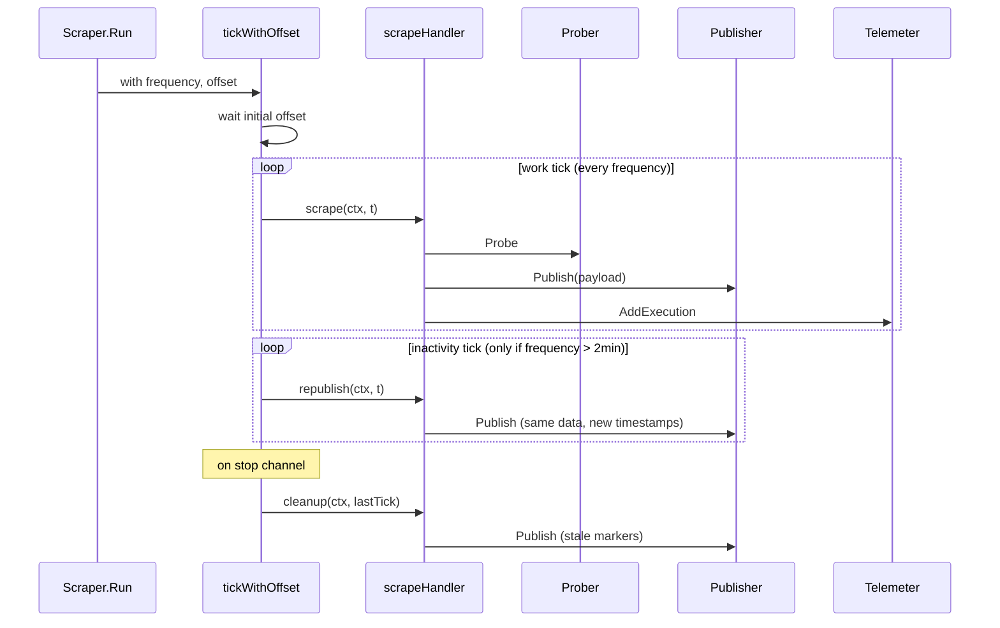

# Scraper — `internal/scraper`

## Purpose

One Scraper exists per active check. It runs the prober on the check's
schedule, decorates the result with check, probe, and user labels, then
hands the payload to the publisher. It also manages the Prometheus
metric lifecycle for the check: emitting **stale markers** on shutdown
and **republishing** metrics for low-frequency checks so the series
doesn't go stale between probes.

## Where it lives

`internal/scraper/`

| File              | Responsibility                                          |
| ----------------- | ------------------------------------------------------- |
| `scraper.go`      | The `Scraper` struct, factory, scheduling loop (`tickWithOffset`), payload assembly, label handling, state machine. |
| `metrics.go`      | The `Metrics` / `Incrementer` / `IncrementerVec` interfaces and the per-scraper metric wrapper. |
| `scraper_test.go` | Golden-file tests against local servers (see below).    |
| `testdata/*.txt`  | Golden Prometheus output for every check type.          |

## How it fits in

```mermaid
flowchart LR
    Updater -->|Factory call| Scraper
    Scraper -->|Probe<br/>ctx, target, registry, logger| Prober
    Prober -.->|scripted / browser / multihttp| K6Runner
    Scraper -->|payload<br/>(metrics + logs)| Publisher
    Scraper -->|AddExecution| Telemeter[internal/telemetry]
    Scraper -->|MetricLabels / LogLabels| Limits[internal/limits]
    Scraper -->|CostAttributionLabels| Cals[internal/cals]
```

## Lifecycle

### Construction

The package-level factory `scraper.New(...)` is the one wired into the
Updater via `scraper.Factory`. It builds the `prober.ProberFactory` from
the k6 runner, probe ID, feature collection, and secret provider, then
calls `NewWithOpts`.

`NewWithOpts` derives a logger with `region_id`, `tenantId`, `check_id`,
`probe`, `target`, `job`, and `check` (the type) labels, creates the
per-scraper context via `context.WithCancel`, and asks the prober
factory for the right `Prober` implementation. The Prober is constructed
*once* per scraper — restarts come from the Updater destroying and
recreating the scraper, not from re-probing.

### Run loop

`Scraper.Run(ctx)`:



Three actions, all defined on `scrapeHandler`:

- **`scrape`** — full probe run. Builds the payload via `collectData`, feeds the check state machine, records a `telemetry.Execution`, and publishes.
- **`republish`** — same payload, timestamps advanced to *now*. Logs are dropped (`streams = nil`) so they aren't duplicated. Triggered by the inactivity ticker.
- **`cleanup`** — runs when the stop channel closes (i.e. the Updater is tearing the scraper down). Replaces every sample value with a stale-marker NaN (`0x7ff0000000000002`) and publishes once more so Prometheus knows the series has ended.

### Shutdown

The Updater calls `Scraper.Stop()` which closes `s.stop`. `tickWithOffset`
sees the close, stops both tickers, calls `cleanup`, and returns. Then
`Run` calls `s.cancel()` to release any prober-bound resources tied to
the per-scraper context.

If the parent context is cancelled instead (e.g. on SIGTERM), `cleanup`
does *not* run — the agent is shutting down and we deliberately skip
the extra publish.

## Scheduling: `tickWithOffset`

The scheduler is a single function. It takes a `period`, `offset`,
`maxIdle` (the republishing threshold — currently `maxPublishInterval`
= 2 minutes), and `minGap` (don't republish within 10s of a real run).

- The initial offset spreads load across scrapers that boot together. If the check has no explicit offset, one is chosen at random in `[0, min(frequency, 2 minutes))`.
- A `workTicker` fires every `period` and calls `work`.
- An `inactivityTicker` only exists if `period > maxIdle`. It fires every `maxIdle` and calls `idle` (= republish), but skips if it's within `minGap` of either side of a real run.
- The stop channel triggers `cleanup`.
- Context cancellation triggers immediate return without `cleanup`.

This is the only place that knows about scheduling timings. Tune
constants (`maxPublishInterval`, `minPublishGap`) in `scraper.go` if
you need to change republishing behaviour.

## Payload assembly: `collectData`

For each probe run:

1. Build **user labels** (from check configuration) and **check-info labels** (probe, region, instance, job, check_name, plus user labels with a `label_` prefix) used by the `sm_check_info` metric.
2. Pull the per-tenant `MetricLabels` and `LogLabels` limits from `LabelsLimiter`. Fail closed if the limiter errors.
3. Capture all check logs into an in-memory `bytes.Buffer` via a `kitlog` logfmt logger. The logger is decorated with every log label.
4. Choose a `timeout`:
   - k6-backed checks (`Scripted`, `Browser`, `MultiHttp`) use `frequency` as the timeout — the k6 runner has its own retry logic and the hard wall is "until the next scheduled run".
   - Everything else uses `Timeout` from the check.
5. Run the prober via `getProbeMetrics`, which creates a fresh `prometheus.Registry`, calls `runProber`, gathers, and adds `sm_check_info` and derived summaries/histograms.
6. Convert the gathered metric families into `prompb.TimeSeries` via `extractTimeseries`.
7. Parse the captured logs into `logproto.Stream`s via `extractLogs`. Loki doesn't support joins, so every stream carries the full label set.
8. Append `probe_success="0"|"1"` to log labels so failed-run lines are easy to filter.
9. Return a `probeData` containing time series, streams, and the tenant's global ID.

`patchDuration` is a workaround: for k6-backed checks the
`probe_duration_seconds` value reported by the prober is "wait +
script" time, while `probe_script_duration_seconds` is the value
operators actually care about. The function rewrites the former to
match the latter when both are present.

## The `sm_check_info` metric

Special metric carrying check metadata for join queries. Defined by:

- name = `sm_check_info`
- value = `1`
- labels = the `checkInfoLabels` built in `buildCheckInfoLabels` (probe, region, instance, job, check_name, frequency, geohash, alert sensitivity, plus user labels with a `label_` prefix).

If you add a new piece of check metadata that operators need to join
on, this is the metric to extend.

## Stale markers

Stale markers are NaN values with a specific bit pattern Prometheus
treats as "series ended". Defined as:

```go
var (
    staleNaN    uint64  = 0x7ff0000000000002
    staleMarker float64 = math.Float64frombits(staleNaN)
)
```

`cleanup` replaces every sample value in the last payload with this
marker and publishes one final time. The timestamp is bumped by 1 ms
past the last real sample so the marker is strictly after the last
real point.

## Check state machine

`checkStateMachine` (`scraper.go`) holds a `passes` / `failures` /
`threshold` triple. `pass()` and `fail()` call back when the *state*
changes (not on every probe), which is how the agent logs "check
entered PASS/FAIL state" without spamming.

Today the threshold is effectively zero (transitions on the first
flip). If you add hysteresis, this is the type.

## Key types and entry points

| Type / function                     | File           | Notes                                                       |
| ----------------------------------- | -------------- | ----------------------------------------------------------- |
| `Scraper`                           | `scraper.go`   | One per active check.                                       |
| `New(...)` / `NewWithOpts(...)`     | `scraper.go`   | Factory; `New` matches `scraper.Factory` consumed by Updater. |
| `(*Scraper).Run(ctx)`               | `scraper.go`   | Scheduled execution.                                        |
| `(*Scraper).Stop()`                 | `scraper.go`   | Closes the stop channel.                                    |
| `tickWithOffset(...)`               | `scraper.go`   | Scheduling primitive (work + idle + cleanup).               |
| `scrapeHandler.{scrape,republish,cleanup}` | `scraper.go` | The three tick actions.                                     |
| `collectData(...)`                  | `scraper.go`   | Probe → payload.                                            |
| `patchDuration(...)`                | `scraper.go`  | Aligns `probe_duration_seconds` with the script duration.    |
| `NewMetrics(...)`, `Metrics`        | `metrics.go`   | Per-scraper scrape / error counters.                        |

## Testing strategy

`internal/scraper/scraper_test.go` runs **golden-file** tests against
local servers:

- For each check type the test brings up a local HTTP / DNS / TCP / gRPC server, constructs a scraper, runs one probe, and compares the gathered metric output against `testdata/<type>.txt` (or `<type>_basic.txt` for `BasicMetricsOnly`).
- Update goldens with `-update-golden` (see the `testdata` Makefile target).
- k6-backed types (`scripted.dat`, `browser.dat`, `multihttp.dat`, `k6.dat`) use pre-captured k6 output rather than launching the real binary, which keeps the tests fast.
- Slow tests (real network) are guarded by `testing.Short()` so `make test-fast` skips them.

Run just this package:

```bash
make test-go GO_TEST_ARGS=./internal/scraper/...
```

## When to update this doc

Update this document when you:

- Change the scheduling primitives in `tickWithOffset` (`maxPublishInterval`, `minPublishGap`, offset randomisation).
- Change the republish or stale-marker behaviour in `scrapeHandler`.
- Add a check-info label or change how `sm_check_info` is assembled.
- Add a new piece of label decoration in `collectData`.
- Change the per-check-type timeout selection in `collectData`.
- Add or remove a collaborator interface (`LabelsLimiter`, `Telemeter`, `TenantCals`).
- Change the contract of `scraper.Factory` (consumed by `internal/checks`).
- Add a new check type whose payload assembly differs from the existing pattern.
- Touch the golden-file harness in `scraper_test.go` or the layout of `testdata/`.
