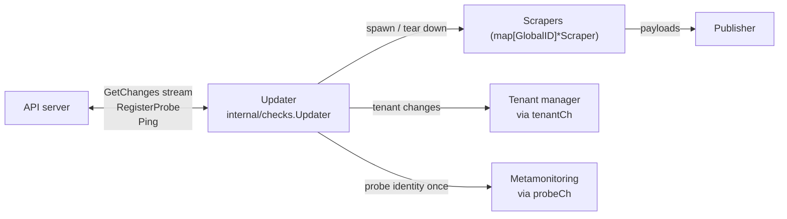

# Updater — `internal/checks`

## Purpose

The Updater is the agent's connection to the API server. It does three
things:

1. Registers the probe with the API and holds a long-lived `GetChanges` stream that pushes check ADD/UPDATE/DELETE operations.
2. Owns the lifecycle of every Scraper — creating one per check, restarting it on UPDATE, tearing it down on DELETE.
3. Survives connection failures with bounded back-off, and supports a "soft disconnect" (SIGUSR1) for zero-downtime upgrades.

Everything else — Scraper, Prober, Publisher — is built once. The
Updater is the moving part that keeps them populated with current
configuration.

## Where it lives

`internal/checks/` — primarily `checks.go`.

## How it fits in



## Lifecycle

### Construction

`NewUpdater(UpdaterOptions)` — called from
`cmd/synthetic-monitoring-agent/main.go`. The options struct injects
every collaborator: gRPC connection, logger, back-off, publisher, tenant
and probe channels, the readiness callback, the k6 runner, a scraper
factory, tenant limits, secret provider, telemeter, usage reporter, cost
attribution labels, and the `SupportsProtocolSecrets` flag.

`NewUpdater` registers all Prometheus metrics owned by the Updater itself
*and* by every Scraper it will spawn (see
[Scraper-owned metrics](#scraper-owned-metrics) below).

### Run loop

`Updater.Run(ctx)`:

```mermaid
sequenceDiagram
    participant Run as Updater.Run
    participant Loop as Updater.loop
    participant API as API server
    participant HE as handleError

    Run->>Loop: call loop()
    Loop->>API: RegisterProbe
    API-->>Loop: probe info + capabilities
    Loop->>API: GetChanges (stream)
    par stream consumption
        Loop->>Loop: processChanges -> handleChangeBatch
    and health pings
        Loop->>API: Ping every HealthCheckInterval
    end
    Loop-->>Run: (wasConnected, err)
    Run->>HE: handleError
    alt fatal
        HE-->>Run: return err
    else transient / unknown
        HE->>HE: sleep backoff.Duration()
        HE-->>Run: loop again
    else context cancelled
        HE-->>Run: return nil
    end
```

`Run` is an infinite `for` loop around `loop` + `handleError`. The
back-off resets when a previously-connected session ends; that way a
healthy probe that briefly loses connectivity doesn't immediately ramp
to the 30-second ceiling.

### Steady state

Inside `loop()`:

- Register the probe (`client.RegisterProbe`). Validate capabilities against the available k6 runner (`validateProbeCapabilities` — returns `errCapabilityK6Missing` if the API expects scripted/browser support but no k6 runner is configured).
- Flip the readiness callback to `true` and the `sm_agent_api_connection_status` gauge to `1` (cleared via `defer`).
- Open the `GetChanges` stream, passing the set of currently-known checks as `ProbeState.Checks`. The API uses this to compute the right starting batch.
- Launch two goroutines via an inner `errgroup`:
  - `ping(...)` — periodic `client.Ping` calls every `synthetic_monitoring.HealthCheckInterval`.
  - `processChanges(ctx, stream)` — main consumer of the change stream.

When either goroutine returns, the loop unwinds and `Run` decides
whether to retry.

### Shutdown

Two shutdown paths:

- **Parent context cancelled** (e.g. SIGTERM). All goroutines unwind, scrapers are stopped via their own contexts (see below), `Run` returns `nil`.
- **Fatal error** (e.g. `errNotAuthorized`, `errIncompatibleApi`, `errCapabilityK6Missing`). `handleError` short-circuits and returns the error.

## SIGUSR1 / `/disconnect` flow

The disconnect path is *intentionally narrow*: only the API stream is
cancelled. Scrapers keep running.

This is implemented by `installSignalHandler(groupCtx)` inside `loop()`.
It returns a derived context (`sigCtx`) that is cancelled when SIGUSR1 is
delivered, plus a `*int32` flag that distinguishes signal-driven
cancellation from a normal context cancel. Crucially, `processChanges`
is called with the *parent* `ctx`, not `sigCtx`, so the
parent-`ctx`-bound child contexts used by every Scraper survive the
disconnect.

When `sigCtx` fires, the gRPC stream returns an error and `loop` exits
with `errProbeUnregistered` (mapped from the `signalFired` flag). `Run`
then back-offs and reconnects. Combined with the back-off (~2s minimum),
this gives a replacement agent a window to register and pick up the
probe's checks.

The HTTP `/disconnect` endpoint is just sugar for `kill -USR1 $pid`;
see [cmd.md](cmd.md).

## Change handling

> **Clustering note.** Every handler below first records the change in
> `knownChecks` (the durable desired state), then routes through
> `reconcileCheckWithLock`, which decides start/stop/restart based on
> ownership and readiness. When clustering is disabled the injected
> `monoNode` owns everything and is always ready, so the behaviour reduces to
> exactly what the bullets describe. See
> [Check ownership and reconciliation](#check-ownership-and-reconciliation).

### First batch

The first batch after each reconnect is special. The server only sends
ADDs (never DELETEs or UPDATEs), so the Updater must reconcile its
running scrapers against the ADDs received:

- For every ADD: if a scraper exists at that `GlobalID` with the same `ConfigVersion`, skip; if it exists with a different version, treat the ADD as an UPDATE; otherwise add and start a new scraper.
- After processing all ADDs, **stop every scraper whose check was not in the first batch** — those have been deleted while the agent was disconnected.

This happens in `handleFirstBatch` / `handleInitialChangeAddWithLock`.
The "delta first batch" optimisation is signalled by
`changes.IsDeltaFirstBatch`: if set, the API is sending an incremental
update instead of a full snapshot, and the regular change handler is
used.

### Subsequent batches

`handleChangeBatch` dispatches each change to:

- `handleCheckAdd` — error if the check already exists. Adds and starts the scraper.
- `handleCheckUpdate` — stops and removes the existing scraper, then re-adds via `addAndStartScraperWithLock`. This is the "lazy way", but it's safe and keeps the update logic in one place.
- `handleCheckDelete` — stops the scraper and removes it from the map.

All three are guarded by `scrapersMutex`.

Tenant changes received alongside checks are forwarded to `tenantCh` so
the tenant manager can refresh its cache.

### Feature-flag gating

`addAndStartScraperWithLock` is the choke point for "do we run this
check type at all?". Currently it gates `CheckTypeScripted` and
`CheckTypeMultiHttp` on the `feature.K6` flag — even though that flag is
permanently enabled today, the gate stays in place so the pattern is
easy to extend. If you add a new check type that should be conditional,
this is the place.

## Check ownership and reconciliation

When the agent runs in a cluster, it is sent the **full** check set for its
ring but should only run the checks it owns (RF=1). The Updater handles this
through a small set of pieces, all guarded by `scrapersMutex`:

- **`knownChecks` is the durable desired state.** `map[GlobalID]model.Check` of
  every check received, owned or not. Handlers write it *before* any gate, so a
  deferral never loses a change — it is replayed later.
- **`reconcileCheckWithLock(cid)`** is the single decision point. It consults
  `node.Ready()` (buffer if the ring hasn't converged — leave scrapers untouched)
  and `node.IsOwner(cid)`, then drives the one check to its desired state: start
  if owned-and-known and not running, restart if the `ConfigVersion` changed, stop
  if no longer owned or no longer known. Starts go through
  `addAndStartScraperWithLock`, stops through `stopScraperWithLock`.
- **`reconcileAll()`** re-runs `reconcileCheckWithLock` over `knownChecks` (and
  stops orphaned scrapers). It is idempotent and is what membership changes
  trigger. `handleFirstBatch` resets `knownChecks` to the batch and calls it, so
  an orphan is a check that is *not in the batch OR not owned*.
- **Observer → reconcile loop.** The cluster node calls
  `Updater.RequestReconcile` on every participant-set change. That does a
  non-blocking send to a buffered `reconcileCh` (coalescing); a single drain
  goroutine (`runReconcileLoop`, behind a `rate.Limiter`) calls `reconcileAll()`.
  This debounces startup churn and keeps reconciliation serialized off the gossip
  goroutine.

The `node cluster.Node` is injected via `UpdaterOptions.Node`; it defaults to
`cluster.NewMono()` (owns everything, always ready), which is why all of the
above is inert unless `-cluster-enabled` is set. The ring side — ownership
hashing, convergence, drain — lives in [cluster.md](cluster.md).

## Error classification

Three custom types from `internal/error_types` drive the loop:

| Type             | Sentinel values defined in | Effect in `handleError`               |
| ---------------- | -------------------------- | ------------------------------------- |
| `FatalError`     | `checks.go`                | Log, return — `Run` exits.            |
| `TransientError` | `checks.go`                | Log warning, sleep `backoff.Duration()`, retry. |
| (anything else)  | wrapped error              | Treated as transient (with a warning). |

`FatalError` and `TransientError` are *types* from `internal/error_types`.
The sentinel error values that use those types (e.g.
`errNotAuthorized = FatalError("...")`) are defined in `checks.go`.

`grpcErrorHandler` (defined inside `loop`) converts gRPC status codes
into the right error type:

- `Canceled` → `context.Canceled` (clean shutdown).
- "transport is closing" message → `errTransportClosing` (transient).
- `Unavailable` → `TransientError`.
- `PermissionDenied` → `errNotAuthorized` (fatal).
- `Unimplemented` → `errIncompatibleApi` (fatal).
- everything else → the underlying gRPC error (treated as transient by default).

The `wasConnected` flag in `handleError` exists so we only reset the
back-off when a *previously healthy* session is interrupted — repeated
registration failures shouldn't keep dropping the back-off back to 2
seconds.

## Probe identity propagation

`notifyProbeTenant` sends the probe pointer into `probeCh` exactly once
(`sync.Once`) and closes the channel. Metamonitoring uses this to learn
which tenant should receive the agent's own metrics. Subsequent
reconnects don't re-send.

## Scraper-owned metrics

The Updater registers four Prometheus vectors *on behalf of every
Scraper it will create*:

- `sm_agent_scraper_operations_total{type, tenantId, regionId}`
- `sm_agent_scraper_errors_total{type, source, tenantId, regionId}`
- `sm_agent_updater_scrapers_total{type}` (gauge — running count)
- `sm_agent_updater_changes_total{type}` and `sm_agent_updater_change_errors_total{type}` (Updater-local).

`addAndStartScraperWithLock` derives a per-check sub-vector
(`CurryWith` / `GetMetricWith`) and hands it to `scraper.NewMetrics`.
This avoids one registration per scraper while keeping per-tenant /
per-region cardinality.

## Key types and entry points

| Type / function                                           | File             | Notes                                              |
| --------------------------------------------------------- | ---------------- | -------------------------------------------------- |
| `Updater`                                                 | `checks.go`      | The struct.                                        |
| `UpdaterOptions`                                          | `checks.go`      | Construction inputs from `cmd/`.                   |
| `NewUpdater(opts)`                                        | `checks.go`      | Builds and registers all metrics.                  |
| `(*Updater).Run(ctx)`                                     | `checks.go`      | Reconnect loop.                                    |
| `(*Updater).loop(ctx)`                                    | `checks.go`      | One full connected session.                        |
| `handleError(...)`                                        | `checks.go`      | Maps errors to retry/fatal/exit decisions.         |
| `installSignalHandler(ctx)`                               | `checks.go`      | SIGUSR1 → derived context.                         |
| `processChanges`, `handleChangeBatch`, `handleFirstBatch` | `checks.go`      | Stream consumption.                                |
| `handleCheckAdd / Update / Delete`                        | `checks.go`      | Per-operation handlers, mutex-guarded.             |
| `addAndStartScraperWithLock`                              | `checks.go`      | Feature-flag gate + Scraper factory invocation.    |

## Testing strategy

Tests live in `internal/checks/checks_test.go`. Patterns to be aware of:

- **Table-driven** with `t.Run(name, ...)`. Most tests construct an `Updater` with the real `NewUpdater`, then drive it through mock collaborators.
- `TestNewUpdater`, `TestNewUpdaterSupportsProtocolSecrets` — verify metric registration and option propagation.
- `TestInstallSignalHandler` — exercises the SIGUSR1 path without a real signal by cancelling the parent context and asserting the `fired` flag stays `0`.
- `TestSleepCtx` — context-aware sleep helper.
- `TestHandleCheckOp` — drives add/update/delete operations through the locked path and asserts scraper-map state.
- `TestCheckHandlerProbeValidation` — exercises the capability / feature-flag interaction.
- `TestHandleError` — covers every branch of `handleError` (fatal/transient/unknown/cancelled) and the back-off reset behaviour.
- `TestProbeTenantCh` — `sync.Once` semantics around probe-id propagation.

Run only this package:

```bash
make test-go GO_TEST_ARGS=./internal/checks/...
```

Tests do not hit a real API server; the gRPC client connection is a
`*grpc.ClientConn` against an in-process server where needed.

## When to update this doc

Update this document when you:

- Add, remove, or rename a `synthetic_monitoring.Checks` RPC consumed by the Updater (e.g. `RegisterProbe`, `GetChanges`, `Ping`).
- Change the back-off strategy used by the reconnect loop (note: the back-off itself is constructed in `cmd/`, but the loop owns when to reset it).
- Add or modify a `CheckOperation_*` case in `handleChangeBatch` or `handleFirstBatch`.
- Add a new check-type gate in `addAndStartScraperWithLock`.
- Change SIGUSR1 / disconnect semantics (including which contexts get cancelled).
- Change the readiness contract (the `IsConnected` callback).
- Add, remove, or rename a field on `UpdaterOptions`.
- Add a new sub-goroutine inside `loop()` (today: `ping` and `processChanges`).
- Change the meaning of any `sm_agent_updater_*` or `sm_agent_scraper_*` metric.
- Add or change behaviour around the `probeCh` / `tenantCh` channels.
