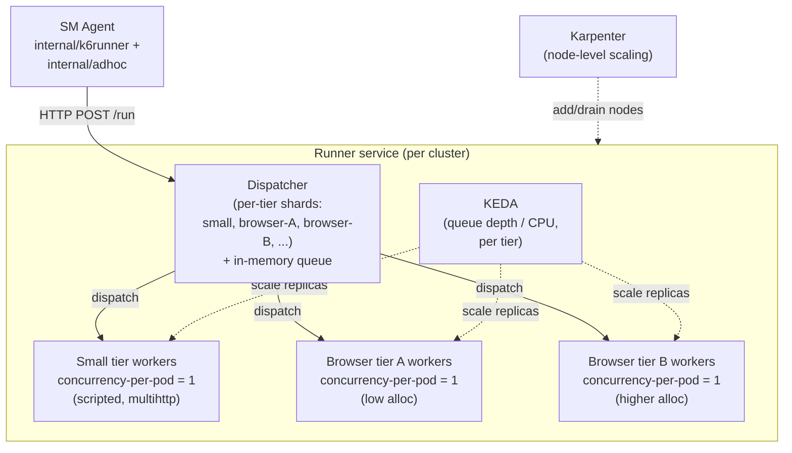

# K6 Runner Service — Spec

> Status: **In Review**
> Owner: marcelo.magallon@grafana.com
> Reviewers: TBD
> Started: 2026-05-01
> Last-updated: 2026-05-01

## Purpose & user problem

The Synthetic Monitoring agent currently executes k6-based checks (scripted,
browser, multihttp) in-process on the same host where the agent runs. This
limits how many concurrent checks a single agent can sustain, especially for
browser checks which are resource-hungry. The agent already has a "remote k6
runner" mode (`internal/k6runner/http.go`) that POSTs a script to an HTTP
endpoint and consumes metrics/logs/error from the response.

What's missing is the **server side** of that contract: a Kubernetes-native
HTTP service that accepts those requests, executes the checks across a pool
of pods, and returns results — at a scale much larger than a single host can
handle, and with the ability to route resource-heavy checks (browser) to
appropriately-sized workers.

## Success criteria

The runner service is considered successful when, deployed in a single
Kubernetes cluster, it can:

1. Accept k6 check execution requests over HTTP from both the
   scheduled-check path (`internal/k6runner/http.go`) and the adhoc path
   (`internal/adhoc/adhoc.go`) without protocol differences from the
   client perspective.
2. Sustain up to **5K concurrent in-flight checks** (with headroom
   to 10K) at ~100 cps, with typical load around 10 cps, while
   meeting:
   - dispatch P99 < 1s for both small and browser tiers,
   - setup + teardown < 500ms for the small tier,
   - setup + teardown < 5s for the browser tier.
3. Route each request to the correct tier based on check type and
   tenant→tier mapping, without the agent declaring a tier.
4. Execute every check in a fresh sandbox (cgroup + namespaces +
   ephemeral filesystem), with no persistent state surviving between
   checks and no cross-tenant leakage. Workers run unprivileged.
5. Distinguish failure causes (script error, timeout, OOM,
   dispatch-capacity, dispatcher-drain, worker-crash-pre-script,
   worker-crash-mid-script, sandbox-isolation-error) on the wire and in
   metrics.
6. Drain gracefully on upgrade: in-queue requests that haven't started
   executing are returned to the agent with a "drain — retry now"
   signal, and the agent reschedules them immediately without
   counting them as failures.
7. Export Prometheus metrics sufficient to operationally tune pre-warm
   pool size, autoscaler thresholds, and tenant tier assignment.
8. Scale workers per tier via KEDA on queue depth and/or CPU; let
   Karpenter handle node-level scaling.

## Scope & constraints

**Scope:**

- A new HTTP service ("k6 runner service") deployed as a per-cluster
  workload, with a dispatcher front-end and per-tier worker
  Deployments behind it.
- Updates to the agent's `internal/k6runner/http.go` and
  `internal/adhoc/adhoc.go` to use the updated wire protocol —
  particularly to handle the new failure-cause taxonomy and the
  dispatcher-drain "retry now" signal.

**Hard constraints:**

- **Per-check isolation is non-negotiable.** Fresh process + fresh
  cgroup + fresh mount namespace + ephemeral filesystem per check.
  Concurrency-per-pod = 1.
- Workers must run unprivileged in a stock Kubernetes pod (user
  namespaces only). No `privileged: true` requirement. Kernel and
  cluster prerequisites are documented under *Lifecycle & isolation
  → Cluster prerequisites*.
- Side-effect-bearing scripts must never be silently re-executed once
  they've started. Server-side retries are only legitimate before the
  script begins running.
- The deferral of an external work queue is acceptable **only because**
  the dispatcher-drain wire signal exists and the agent honours it; if
  that link breaks, an external durable queue moves back into v1.

**Soft constraints / preferences:**

- HTTP over gRPC for v1 to minimise client churn.
- In-memory queue for v1; pluggable for future external broker.

## Technical considerations

### Architecture overview

Two diagrams: request flow (per-check, covering the three
dispatch-flow response classes — success, dispatcher-drain,
no-worker-within-hold) and deployment topology (per-cluster
dispatcher shards + per-tier worker Deployments + KEDA + Karpenter).
**In-execution failure paths** (worker-crash-pre-script,
worker-crash-mid-script) and **sandbox-isolation-error** are
described in prose under *Failure & retry semantics* — they are
state-machine decisions that don't fit a sequence diagram cleanly.

```mermaid
sequenceDiagram
    participant Agent as SM Agent<br/>(internal/k6runner,<br/>internal/adhoc)
    participant Dispatcher
    participant Worker as Worker pod<br/>(concurrency = 1)
    participant Sandbox as Per-check<br/>sandbox

    Agent->>Dispatcher: POST /run (check, tenant)
    Dispatcher->>Dispatcher: infer tier<br/>(check type + tenant table)

    alt worker available within hold (default 2s)
        Dispatcher->>Worker: dispatch
        Worker->>Sandbox: create<br/>(fresh ns + cgroup + tmpfs upper)
        Sandbox->>Sandbox: exec sm-k6 / Chromium
        Sandbox-->>Worker: result + exit cause
        Worker->>Sandbox: teardown (kill cgroup, unmount)
        Worker-->>Dispatcher: result
        Dispatcher-->>Agent: 200 result<br/>(success or failure-cause-tagged)
    else dispatcher draining
        Dispatcher-->>Agent: 503 + drain marker<br/>("retry now, not a check failure")
        Note over Agent: reschedule immediately,<br/>no backoff, no failure count
    else no worker within hold
        Dispatcher-->>Agent: 503 dispatch-capacity<br/>(retriable; standard backoff)
    end
```



### Dispatch model — decided

**Worker-pool Deployments per resource class.** Rejected alternatives:

- **Job-per-check:** pod cold-start (seconds) is fatal for typical SM check
  cadence (30s–1min); also imposes heavy churn on the K8s control plane at
  scale.
- **Hybrid (warm pool + ephemeral Jobs for outliers):** two code paths, not
  worth the complexity unless the long tail proves it's needed.

The runner service is a **front-end** that owns a queue and dispatches work
to pre-warmed workers in per-tier Deployments. KEDA + Karpenter are already
available in our infra and known to work for queue-depth / CPU based
autoscaling, so each tier scales independently.

The existing in-house solution is intentionally ignored for this design;
this Spec is a from-scratch comparison point.

### Resource tiering — decided

**Tiers:**

- One small tier for scripted / multihttp checks.
- **Multiple browser tiers** (browser-A, browser-B, …) at different
  CPU/RAM allocations, used for plan-based separation. Free-tier
  customers run on the lowest-allocation browser tier (`browser-A`
  by default); customers on higher-paid plans map to
  higher-allocation tiers (`browser-B` and beyond).
- No "medium" tier is needed at this point.

**Indicative resource shapes** (illustrative; final values tuned by
pre-warm and pool sizing work — see *Scope — v1 vs. deferred*):

| Tier | CPU request/limit | Memory request/limit | Notes |
|---|---|---|---|
| `small` | ~500m | ~512 MiB | Scripted / multihttp; sandbox + `sm-k6` + light I/O |
| `browser-A` | ~1 CPU | ~1 GiB | Free-tier browser pool; one Chromium per pod |
| `browser-B` | ~2 CPU | ~4 GiB | Higher-allocation browser pool for advanced plans |

These are reviewer-intuition shapes (and the input to back-of-envelope
Karpenter cost math), not commitments.

**Outlier handling:** every check carries a timeout. Workers enforce that
timeout and cancel the execution if exceeded; resource usage during the
attempt is still accounted for. Pathologically heavy checks within the
timeout are tolerated (or OOM-killed) rather than designed for.

**Routing — server-inferred:**

The runner service decides the tier in two stages:

1. **Check type → tier family.** Scripted / multihttp → small
   family; browser → browser family. The check type alone determines
   the family; the tenant mapping cannot move a browser check to the
   small family or vice versa.
2. **Tenant → tier within the family.** Picks the specific tier
   inside the family chosen above. Today the small family has one
   tier (`small`), so this stage is a no-op there. The browser family
   has multiple tiers (`browser-A`, `browser-B`, ...); the tenant
   mapping selects which one. A tenant absent from the mapping falls
   back to the lowest tier in the family (free-tier resourcing).
   Future: signal-driven reassignment based on observed check
   behavior.

**Mapping storage and reload.** The mapping lives in a Kubernetes
ConfigMap mounted into the dispatcher pods, managed via the standard
GitOps repo for the cluster. The dispatcher watches the mounted file
via fsnotify and reloads in place when the kubelet propagates a
ConfigMap update (typically ≤ ~60s after the commit lands on the
cluster). Reload is atomic — a partially-read or malformed ConfigMap
never replaces the live mapping; on parse error the dispatcher keeps
serving with the last-known-good mapping and emits a metric so the
problem is visible.

**Schema** (illustrative):

```yaml
# tenant-tier-mapping.yaml
browser:
  default: browser-A          # lowest browser tier; fallback for unlisted tenants
  tenants:
    tenant-1234: browser-B
    tenant-5678: browser-B
small:
  default: small              # only one small tier today; entry reserved
                              # for the future case of small-family variants
```

A tenant entry whose target tier is not a deployed worker pool is a
configuration error. The dispatcher logs it, increments a
`tenant_tier_mapping_errors_total{cause="unknown_tier"}` counter,
and refuses to dispatch checks of the affected family for that
tenant until the mapping is fixed. Failing loudly beats silently
routing to the wrong tier.

The agent does not declare a tier. The wire protocol between agent
and runner is allowed to evolve as needed (no hard backward-compat
constraint with the current `http.go` shape).

**Fairness within a tier — accepted v1 risk.** Tier separation is the
only fairness mechanism in v1: tenants on different tiers do not
affect each other (separate Deployments, separate worker pools,
separate dispatcher shards). Tenants on the *same* tier share its
finite worker pool with no per-tenant quota, no in-flight cap, and
no fair queueing.

The risk this accepts: a single tenant generating an unusual burst
of checks on a shared tier (most consequentially on the default
browser tier, where unlisted tenants land) can fill the queue and
cause other tenants on that tier to see elevated dispatch latency
or 503 dispatch-capacity errors during the burst.

Why this is acceptable for v1:

- Tier separation already isolates plan tiers from each other —
  paid customers on `browser-B` are unaffected by free-tier bursts
  on `browser-A`.
- Per-tenant scheduled-check rate is bounded by the SM check
  configuration (frequency × number of checks); there is no cheap
  way for a tenant to trigger pathological burst patterns via
  configuration alone.
- Adhoc traffic from the UI is naturally rate-limited by the
  human at the keyboard. Adhoc traffic from API integrations (CI
  systems, custom scripts) is bounded upstream by the
  synthetic-monitoring control plane's API rate limits before it
  reaches the runner; the `caller_hint=adhoc` label on dispatch
  metrics makes API-driven bursts distinguishable from scheduled
  spikes, so operators can see and attribute the source if it
  becomes a problem.

If real-world operation shows persistent noisy-neighbour problems
on a shared tier, the v2 fixes are already enumerated in
*Deferred*: a per-tenant in-flight cap (cheap, single bounded
counter on the dispatcher) is the obvious first step, with full
per-tenant fair queueing as the larger second step. v1 ships
without either, deliberately. The metrics needed to detect when
they're warranted (queue depth per tier, dispatch latency P99 per
tier, failure-cause counters labelled by tenant) are in scope.

### Lifecycle & isolation — decided

**Pod lifecycle:** long-lived, managed by Deployment + HPA/KEDA, drained
on scale-down.

**Concurrency per pod:** **1**, across all tiers. Each pod processes
one check at a time. The reasons:

- **KEDA signal cleanliness.** With concurrency=1, "pod has a check"
  is binary, queue-depth-driven scaling is trivial, and the
  autoscaler does not need a per-pod free-slot signal.
- **Eviction / drain blast radius.** A pod going away (node loss,
  rolling upgrade, KEDA scale-down) affects at most one check. With
  N>1 the in-execution-failure path multiplies and partial-pod
  drains get fiddly.
- **Pod-level metrics map 1:1 to checks.** kubelet's per-pod CPU,
  memory, OOM, and restart counters double as per-check signals,
  which is operationally simpler than per-pod-aggregated multi-check
  stats.
- **Browser tier's natural fit.** A browser-tier pod is sized for one
  Chromium; running two would exceed the envelope, so for browser
  this is a resource constraint, not a design choice.

The small tier pays for this: a pod sized for one scripted check is
over-provisioned during the gaps between checks. At v1 scale and
typical load (~10 cps) the absolute pod count is small enough for
this to be an accepted tradeoff. Pod-level utilisation is tracked
(see *Metrics*) so a future revisit of small-tier concurrency is a
data-driven decision rather than a guess.

**Per-check execution:** fresh process **per check, in a fresh sandbox**.
Fork-exec alone is **not** sufficient — isolation is a hard, non-negotiable
requirement. Each execution gets:

- A fresh **mount namespace** with an isolated filesystem root
  (overlay/tmpfs), torn down completely after the run.
- A fresh **cgroup** for CPU/memory accounting and limit enforcement
  (also makes timeout-driven cancellation a clean operation: kill the
  cgroup).
- Additional namespaces per check: pid, ipc, uts. The **net namespace
  is the pod's** — not per-check — see *Pre-warming vs.
  fresh-per-check* for why the network boundary sits at the pod.
- No persistent state survives across executions.

**Pre-warming vs. fresh-per-check.** "Fresh sandbox per check"
applies to *writable and stateful* sandbox elements; *read-only*
artifacts that are inherently shared across checks are pre-staged at
pod startup. The split:

| Element | Lifecycle | Source of freshness |
|---|---|---|
| `sm-k6` / Chromium binary on tmpfs | Reused (pod-lifetime) | Read-only, no per-check state |
| Read-only base layer (libs, fonts, browser profile skeleton) | Reused (pod-lifetime) | Read-only |
| Mount namespace | Fresh per check | `clone(CLONE_NEWNS)` |
| Overlay / tmpfs upper-dir (writable scratch) | Fresh per check | New tmpfs mount, torn down at end |
| cgroup | Fresh per check | New cgroup, killed at teardown |
| pid / ipc / uts namespaces | Fresh per check | `clone(CLONE_NEWPID \| ...)` |
| net namespace | Reused (pod's namespace) | Pod boundary + concurrency-per-pod=1; supervisor resets transient state between checks (see note) |
| Worker process (supervisor) | Reused (pod-lifetime) | No per-check state in supervisor |
| `k6` / Chromium **process** | Fresh `exec` per check | New process tree inside the new sandbox |

**Note on the net namespace — the one explicit exception.** The net
namespace is shared with the pod rather than created via
`CLONE_NEWNET` per check. Justification:

- With concurrency-per-pod=1, the pod's netns is single-tenant for
  the duration of any one check; there is no concurrent neighbour
  to leak to *during* execution.
- Pod-level CNI, NetworkPolicy, and service mesh sidecars (where
  present) continue to constrain traffic the same way they would
  for any other workload — the network boundary that matters
  (cross-tenant, cross-pod) is unchanged.
- Per-check netns alternatives (slirp4netns, veth+NAT inside the
  pod) eat into the dispatch-latency budget without adding
  isolation beyond what the pod boundary already provides.

Between checks the supervisor resets transient pod-level network
state to prevent leakage to the next check on the same pod: drop
any sockets the previous check left behind (`ss --kill` scoped to
the check's former PID set), flush conntrack rows for those PIDs,
and reject the pod if any check leaves the pod with non-default
`/proc/sys/net/*` values it didn't have at startup.

**Verifying the reset path.** Because the net namespace is the one
exception to fresh-per-check, the reset path needs verifiable
controls — not just a "the supervisor handles it" promise. Two
complementary mechanisms ship in v1:

- **Integration test (CI gate).** An acceptance test runs *check A*
  on a worker pod — deliberately stateful: opens a long-lived TCP
  socket, leaves a conntrack entry, writes a non-default
  `/proc/sys/net/*` key — immediately followed by *check B* on the
  *same* pod, which probes for any of those artifacts. B must
  observe zero leakage. The test gates merges to the runner repo;
  any change that touches the supervisor's net-reset path must
  keep this test green.
- **Live audit endpoint + counter.** The supervisor exposes a
  read-only `/admin/net-state` endpoint listing open sockets,
  conntrack entries, and modified `/proc/sys/net` keys at the
  moment of the call. The supervisor polls this state itself
  between checks; any non-zero residue at handover time
  increments `net_state_residue_total{tier=...}` and rejects the
  pod (next check is sent elsewhere; the pod is replaced). The
  endpoint is also reachable via `kubectl exec` for ad-hoc
  debugging. `net_state_residue_total > 0` is an alertable
  condition.

The invariant is: **writable state is either created fresh per
check or actively reset between checks; only inherently read-only
artifacts are simply reused.** Auditable by inspecting the tmpfs
layer (must contain no writable state), confirming the supervisor
never retains check-derived data across executions, and — for the
net namespace specifically — by the CI integration test plus the
live `net_state_residue_total` counter staying at zero.

**Browser tier — Chromium is exec'd fresh per check** (option A).
The binary lives in tmpfs and the OS page cache makes the first
read fast; subsequent execs are essentially memory-warm. We do
**not** pre-launch Chromium and adopt it into a per-check sandbox
in v1. That option (B below) is faster but parking-and-adopting
Chromium across a user-namespace boundary is fragile and erodes the
"writable-is-fresh" invariant.

**Future evaluation: pre-launched Chromium (option B).** Revisit if
*any* of the following holds for the browser tier over a sustained
window (≥ 7 days):

- `setup_teardown_latency_seconds` P99 breaches the 5s SLO.
- `setup_teardown_latency_seconds` P50 exceeds 2.5s (the median
  check is spending more than half the budget on setup, leaving
  little room for the scripted work itself).
- Pre-warm replica count required to meet SLO consistently exceeds
  ~2× active demand (i.e., over-provisioning becomes the dominant
  cost driver instead of execution).

If a trigger fires, an implementation spike for B must demonstrate
that the writable-is-fresh invariant survives the adoption
mechanism, including explicit tests that the per-check sandbox
cannot observe state from a previous check via a parked Chromium.

**Cluster prerequisites.** Per-check sandbox creation happens *inside*
the worker pod (no privileged init container, no host capabilities
borrowed). That means the pod must be able to call
`clone(CLONE_NEWUSER | CLONE_NEWNS | CLONE_NEWPID | CLONE_NEWIPC | ...)`
unprivileged. The validated baseline is:

- **Kubernetes ≥ 1.33** as the documented floor; the runner is built
  and tested against this version.
- **Linux ≥ 5.10**, with `kernel.unprivileged_userns_clone = 1`
  (default on current distros).
- **Default seccomp / AppArmor profile** that does not block the
  `clone` flags above. Stock `RuntimeDefault` profiles in our clusters
  are known to allow them; bespoke restrictive profiles are out of
  scope.
- **cgroup v2** with the unified hierarchy mounted, and kubelet
  configured to delegate `cgroup.procs` writability into the pod
  (standard with the systemd cgroup driver + cgroup v2).

Pod-level user namespaces (`pod.spec.hostUsers: false`, K8s
`UserNamespacesSupport` feature gate, GA in 1.33) are **optional
hardening** layered on top: they reduce host-side blast radius if a
sandbox is breached, but they don't replace the per-check sandbox
described above and they don't change the design. v1 ships without
requiring them; enabling them by default on supported clusters is a
follow-up hardening item.

**Sandbox implementation: bubblewrap.** v1 uses
[bubblewrap](https://github.com/containers/bubblewrap) as the
per-check sandbox tool — decided up front rather than left to the
implementation phase. Rationale:

- Designed for unprivileged sandboxing inside an existing user
  namespace; matches *Cluster prerequisites* exactly (no
  `privileged: true`, no host capabilities beyond in-pod user
  namespaces).
- **Documented Chromium compatibility.** Flatpak's runtime
  sandboxes Chromium-based applications via bubblewrap in
  production at scale (Steam's Steam Linux Runtime is another
  widely-deployed example). Chromium's own `CLONE_NEWUSER`-based
  sandbox nests cleanly on top of bubblewrap's. This is the
  strongest unprivileged Chromium-in-sandbox prior art available.
- Single static binary, no daemon, no setuid; deploys cleanly in
  the worker pod's tmpfs alongside `sm-k6` / Chromium.

Cgroup management is the supervisor's job, not bubblewrap's: the
supervisor creates the cgroup via cgroup v2 syscalls before exec,
moves the bubblewrap'd process in, and uses `cgroup.kill` for
timeout-driven termination.

**Browser-tier acceptance test (v1 gate).** Before the browser
tier rolls to production, an integration test must run a
representative suite — login flow, multi-page navigation,
screenshot — through bubblewrap'd Chromium with the documented
seccomp / AppArmor profile, and pass. This gates browser-tier
rollout (small-tier rollout is not gated by this test).

**Fallbacks.** If bubblewrap proves unworkable for a reason not
caught in v1 testing, `runc`/`crun` invoked as a library
(libcontainer / youki) or a hand-rolled `unshare`/`clone` wrapper
plus cgroup v2 remain documented alternatives. The v1 performance
budgets, acceptance tests, and operational metrics all assume
bubblewrap; switching is a v1.x decision that requires
re-validating those numbers.

### Failure & retry semantics — decided

**(a) Pre-execution / dispatch failures.** Server holds the request
for a bounded interval waiting for a worker — **default 2s**,
configurable per tier in the dispatcher's config (same ConfigMap
as the tenant→tier mapping, under a separate top-level key). The
2s default sits well below the per-tier agent-side grace (3s
small / 8s browser, see *Scale targets → Agent-side request
budget*) and below the smallest check timeout the SM API
currently allows, so a hold that runs to its full duration does
not blow the agent's budget. KEDA scale-up takes ~10s end-to-end, so 2s does
not bridge a real worker shortage; it absorbs sub-second jitter
and brief autoscaler lag. If no worker is available within the
hold, return a retriable error to the agent (HTTP 503-class) so
the agent's existing backoff kicks in.

**(a') Dispatcher drain / shutdown.** Distinct from (a). When the
dispatcher (or a tier-shard of it) is being upgraded or otherwise
deliberately drained, in-queue requests that have **not yet been
dispatched to a worker** must be returned to the agent with a clearly
distinct status code / reason — *not* a generic 503, *not* a check
failure. The agent treats this as **"reschedule immediately, no
backoff, no failure count"**. This requires both:

- A response code/header on the wire that the agent recognises as
  "drain — retry now" (e.g. HTTP 503 + a `Retry-After: 0` plus a custom
  header, or a dedicated status code in the body schema).
- Agent-side handling in `internal/k6runner/http.go` that routes that
  signal to immediate-retry rather than the standard backoff path.

**(b) In-execution failures (worker crash, eviction, etc.).**

- If the script **had not started executing yet** when the worker died,
  reschedule transparently to another worker.
- Once the script has started executing, **no silent server-side retry**.
  Side-effect-bearing scripts (e.g. HTTP POSTs) must not be double-fired.
  The check fails this tick; the next scheduled tick handles recovery.

**(c) Check-script outcomes — never retried.** All of the following are
real check results and reported as such:

- **Script timeout** — reported as a failed execution with timeout cause.
- **OOM** — tracked and reported (resource accounting + failure cause);
  the runner must surface OOM distinctly so we can analyze customers
  whose checks repeatedly hit the limit.
- **Script error** (any non-zero exit / runtime error inside k6) —
  reported as a check failure.

The runner service must distinguish these failure causes in its response
schema so the agent (and downstream telemetry) can attribute them
correctly.

### Scale targets & SLOs — decided

| Metric | Target |
|---|---|
| Concurrent in-flight checks | **5K v1 target**, with headroom to 10K (see *Dispatcher capacity envelope* below) |
| Throughput (sustained) | designed for **~100 checks/sec**; typical load **~10 cps** |
| Dispatch latency, P99 (small + browser) | **< 1s** |
| Setup + teardown overhead (small tier) | **< 500ms** |
| Setup + teardown overhead (browser tier) | **< 5s** |
| Deployment topology | **per-cluster** runner service; no cross-cluster fan-out |

**Implications baked into the design:**

- A single dispatcher process can serve the 5K v1 target with
  headroom (see *Dispatcher capacity envelope* below); per-tier
  dispatcher sharding (small vs. each browser tier) is desirable so
  a browser surge can't starve small-tier dispatch. Horizontally
  scaling the dispatcher is a future concern, not a v1 requirement.
- The work queue can be **in-memory** at v1 scale. An external broker
  (Redis Streams, NATS) is a future option if we need HA dispatchers or
  a cross-process queue, but not on the critical path now.
- Per-cluster scoping keeps the queue local; no global ordering, no
  cross-region egress in the dispatch path.
- The browser setup+teardown budget (5s) is what makes pre-warming
  important: workers pre-stage read-only artifacts (binary in tmpfs,
  base layer for the overlay) at pod startup, and create the
  per-check writable sandbox at request time. See *Lifecycle &
  isolation → Pre-warming vs. fresh-per-check* for the exact split
  between reused and fresh-per-check elements, and the triggers for
  revisiting Chromium pre-launching.

**Dispatcher capacity envelope.** Back-of-envelope sizing for a Go
HTTP dispatcher process holding open connections + per-check
goroutines + queue entries:

| Resource per in-flight check | Estimate | At 5K in-flight | At 10K in-flight |
|---|---|---|---|
| Goroutines (HTTP handler + queue waiter, ~1–2 per request) | ~8–16 KB stack each | ~40–80 MB | ~80–160 MB |
| HTTP/2 connection state (shared across agent conns) | ~10 KB / conn | negligible | negligible |
| Queue entry (request payload, headers, ctx) | ~5–20 KB | ~25–100 MB | ~50–200 MB |
| File descriptors (1 / conn + a few per entry) | well under default `nofile=65536` | OK | OK |
| **Heap total (rough)** | | **~100–200 MB** | **~200–400 MB** |
| **CPU** | dispatch is mostly sleep + small router lookup; no per-check work | low | low |

A 1 GiB dispatcher pod has 4–5× headroom over 5K in-flight; 10K
sits comfortably below the heap budget too. The realistic
bottleneck is goroutine + queue-entry memory, not CPU — at
~100 cps sustained the dispatch loop is mostly idle. Per-tier
sharding is still the right choice (so a browser surge can't
starve small-tier dispatch), but the sharding is for **fairness**,
not single-process capacity.

**v1 readiness gate.** A benchmark must validate this envelope
before v1 launch: 5K simulated in-flight checks, 100 cps
sustained, heap < 250 MB, P99 dispatch latency < 1s. Failure to
meet these moves *Horizontally-scaled / HA dispatcher* from
deferred back into v1 scope.

**Agent-side request budget.** The agent (`internal/k6runner/http.go`)
must budget for the per-stage SLOs above plus a small network
allowance, with headroom. This replaces the existing 20s blanket
grace, which was sized for the in-process model:

| Tier | Per-stage P99 sum | Agent-side budget (= `check_timeout` + grace) |
|---|---|---|
| Small | 1s dispatch + 500ms setup/teardown + 200ms RTT ≈ **1.7s** | `check_timeout + 3s` |
| Browser | 1s dispatch + 5s setup/teardown + 200ms RTT ≈ **6.2s** | `check_timeout + 8s` |

To validate the budgets are right, the agent must export:

- **`agent_runner_request_duration_seconds`** — histogram of total
  agent-observed request latency (from request send to
  result/error received), labelled by tier and outcome (success /
  failure / budget-exceeded). Bucket boundaries placed for
  visibility near the budget (e.g., for browser: ..., 5s, 6s, 7s,
  8s, 10s, +Inf). A growing right tail near the budget is the
  signal it's too tight.
- **`agent_runner_request_budget_exceeded_total`** — counter for
  requests cut off by the agent-side budget, labelled by tier. The
  expected steady-state value is ≪ the runner's reported
  timeout-cause count, since most check timeouts should be
  detected and reported by the runner *before* the agent's wrapper
  budget fires. If this counter materially exceeds the runner's
  timeout count for a tier over a sustained window, the budget is
  squeezing checks the runner considers still in progress — raise
  the grace.

### Scope — v1 vs. deferred

**In scope for v1:**

- Worker-pool Deployments per tier (small + multiple browser tiers).
- Sandbox per check: cgroup + namespaces + ephemeral filesystem,
  unprivileged.
- Tenant→tier static mapping (config-driven; no UI surface).
- KEDA autoscaling on queue depth and/or CPU per tier.
- Updated request/response wire protocol between agent
  (`internal/k6runner/http.go`) and runner — including the
  failure-cause taxonomy listed in success criterion #5 (the wire
  must distinguish all 8). The exact wire-protocol shape
  (request/response field schemas, the response code/header used
  for the dispatcher-drain marker, the `caller_hint` and
  failure-cause field encodings) is detailed in a follow-up RFC;
  this Spec commits to the failure-cause taxonomy, the
  dispatcher-drain signal class, and the `caller_hint` field's
  existence and semantics.
- HTTP transport (gRPC deferred).
- **Adhoc check support** — `internal/adhoc/adhoc.go` becomes
  another caller of the same runner API: same endpoint, same
  request/response shape, same dispatch path, same tiering. Output
  is identical to scheduled; the agent extracts the UI-facing
  summary from the standard runner output on its side (today's
  `internal/adhoc` code already does this). The only wire
  acknowledgement of the caller is one optional
  `caller_hint: "adhoc" | "scheduled"` field, used for metric and
  log labelling only — the runner makes no behavioural decision
  based on it. The agent still owns publishing adhoc results as
  logs.
- Health / readiness endpoints, graceful drain (drain semantics tie into
  the "dispatcher-drain" wire signal above).
- Observability — see *Metrics* below.

**Deferred to a later iteration:**

- Secrets store integration on the runner side (today's behaviour: the
  agent already negotiates secrets and passes what's needed in the
  request).
- Per-tenant quota / rate limiting at the runner. Tier separation
  is the v1 lever — see *Resource tiering → Fairness within a tier*
  for the accepted risk and the v2 path forward (per-tenant
  in-flight cap, then full fair queueing).
- Signal-driven tier reassignment (auto-promote tenants whose checks
  repeatedly OOM / hit limits). v1 is manual reassignment via config.
  Observability metrics from v1 feed the eventual auto path.
- Horizontally-scaled / HA dispatcher. Single dispatcher process per
  tier shard is sufficient at v1 scale.
- External work queue (NATS / Redis Streams / Kafka). In-memory queue
  is sufficient at v1 scale, **but** the dispatcher-drain wire signal
  (above) must work correctly so deferring this does not cause check
  losses during upgrades / restarts.
- Pre-warm pool sizing and minimum-replicas tuning. The mechanism is
  in scope; the chosen numbers are an operational tuning concern. The
  metrics required to make those decisions are explicitly in scope
  (see *Metrics*).

### Metrics (in scope for v1)

The runner service must export Prometheus metrics sufficient to make
operational decisions about pre-warm pool size, autoscaler thresholds,
and tier promotion. At minimum:

- **Queue depth** per tier (gauge).
- **In-flight checks** per tier (gauge).
- **Dispatch latency** — time from request received to worker assigned —
  histogram, per tier. Used to verify the P99 SLOs and to detect
  capacity pressure before queue depth blows up.
- **Setup + teardown latency** (sandbox creation, k6 process start,
  sandbox teardown) — histogram, per tier. Drives pre-warm decisions.
- **Worker pool size / ready count** per tier (gauge). Tells operators
  whether a queue spike is "no headroom" or "scheduler stuck".
- **Worker pod utilisation per tier** — `in_flight / pool_size` as a
  recorded gauge, plus a histogram over a rolling window. Surfaces
  whether small-tier pods are systematically under-used at
  concurrency-per-pod=1 and feeds a future decision on revisiting
  concurrency for that tier.
- **Failure-cause counters** — script error, timeout, OOM, worker
  crash (pre-script vs. mid-script), dispatch capacity, dispatcher
  drain — labelled by **tier only**, not by tenant. High-cardinality
  per-tenant attribution stays in the structured logs (below);
  per-tenant alerting is recovered via Loki recording rules that
  derive aggregate counters from log streams (e.g.,
  `sum by (tenant_id) (rate({source="runner"} | json |
  exit_cause="oom" [5m]))`). This keeps long-term metrics
  cardinality bounded while preserving the operational signals
  that drive action — per-tenant OOM rate, per-tenant
  sandbox-isolation errors, per-tenant dispatch-capacity 503s —
  for alerting and investigation.
- **Cold-start counter / histogram** — counts checks that landed on
  a worker pod with **process uptime < 60s** at dispatch time
  (KEDA's typical scale-up window, during which OS page-cache and
  any pre-warm-in-progress effects haven't fully settled). The
  histogram tracks setup+teardown latency for those checks
  specifically; comparing it to the regular setup+teardown
  histogram quantifies the cost of running pre-warm too lean. The
  60s threshold is configurable per tier (in the dispatcher config,
  same ConfigMap pattern as the hold interval and tenant→tier
  mapping).
- **Sandbox isolation errors** — sandbox creation failed, cgroup
  attach failed, etc. (counter). Should be ~0; non-zero means the
  isolation layer is broken.

Structured logs (per execution): check id, tenant id, check type,
tier, caller_hint (`scheduled` / `adhoc`), worker pod, dispatch
latency, run latency, exit cause. These fields are the substrate
for the Loki recording rules that recover per-tenant metrics — any
field used for alerting must be present and consistent here.

## Out of scope

The following are explicitly **not** part of this design:

- **Job-per-check** dispatch (rejected — cold-start cost).
- **Pod reuse for multiple concurrent checks** (rejected — concurrency
  per pod is 1, by isolation requirement).
- **Multi-tenant-per-pod** execution (rejected — isolation is
  non-negotiable).
- **A "medium" tier** between small and browser.
- **gRPC transport** for v1.
- **Cross-cluster / global runner service.** Each cluster runs its own
  runner; agents talk to their local cluster's runner.
- **Secrets store integration on the runner side.** Secrets are still
  the agent's concern; whatever the agent already passes in the
  request is what the worker uses.
- **Per-tenant rate limiting / quota at the runner.**
- **Automatic, signal-driven tenant→tier reassignment.** v1 is static
  config.
- **Horizontally-scaled / HA dispatcher**, **external work queue**,
  and **operational tuning of pre-warm pool sizes** — all deferred,
  see *Scope — v1 vs. deferred* above.
- **The existing in-house runner implementation.** This Spec is a
  from-scratch design intended for comparison; integration with /
  migration from any existing runner is a separate effort.

## Review checklist

For reviewers. Companion brief and analysis findings live in
[`k6-runner-service-spec.review.md`](./k6-runner-service-spec.review.md).

### Architecture

- [ ] Does the chosen worker-pool model address all stated SLOs at
  the v1 target (5K in-flight, ~100 cps sustained)?
- [ ] Are the 8 failure causes sufficient to attribute all
  real-world outcomes? (script error / timeout / OOM /
  dispatch-capacity / dispatcher-drain / worker-crash-pre-script /
  worker-crash-mid-script / sandbox-isolation-error)
- [ ] Is the dispatcher-drain → agent retry-now path actually
  airtight enough to defer an external queue?
- [ ] Does the per-check sandbox model (cgroup + namespaces +
  ephemeral fs, concurrency=1, net-ns shared with the pod) hold up
  for both small-tier and browser-tier workloads?
- [ ] Is server-inferred tiering (vs. agent-declared) the right
  call? Any case where the agent has information the runner doesn't?

### Completeness

- [ ] Are the rejected alternatives (Job-per-check, Hybrid) actually
  excluded for the right reasons?
- [ ] Is the v1-vs-deferred split realistic? Anything in "deferred"
  that will actually be needed at v1?
- [ ] Is the metrics-vs-logs split right? Per-tenant attribution
  lives in logs (Loki recording rules); runtime metrics are
  tier-only — does this support the alerts operators will want to
  write?
- [ ] Adhoc check support: does the wire protocol carry everything
  `internal/adhoc/adhoc.go` needs to publish results as logs?

### Feasibility

- [ ] Are the documented cluster prerequisites (K8s ≥ 1.33, Linux
  ≥ 5.10, `unprivileged_userns_clone=1`, default seccomp/AppArmor
  permissive, cgroup v2 + delegation) verifiable in CI / cluster
  bootstrap?
- [ ] Is the browser-tier acceptance test (login / multi-page nav /
  screenshot through bubblewrap'd Chromium) sufficient to prove
  production readiness, or are there workloads it misses?
- [ ] Is the net-namespace exception (pod boundary + supervisor
  reset + CI integration test + `net_state_residue_total` counter)
  trustworthy as the primary network-side tenant-isolation control?
- [ ] **Per-cluster scale:** at 5K browser pods worst case, is the
  cluster sized for it? Karpenter cost?
- [ ] Is the v1 readiness gate (5K simulated in-flight, 100 cps,
  dispatcher heap < 250 MB, P99 dispatch < 1s) the right gate? Does
  it cover the failure modes that matter, or only the happy path?

### Operational readiness

- [ ] Are the listed metrics enough to **tune** pre-warm pool size
  and autoscaler thresholds, not just observe?
- [ ] Is the metrics-tier-only + Loki-recording-rules pattern
  operationally workable for per-tenant alerting? Will on-call
  actually write and maintain those rules?
- [ ] Drain procedure: what happens if a dispatcher pod is
  hard-killed (SIGKILL / node loss) before it can emit drain
  signals?
- [ ] Rollback story: if the new runner regresses, how does the
  agent switch back to in-process execution?

### Wire protocol & agent integration

- [ ] Is "wire protocol allowed to evolve" + agent changes in
  `internal/k6runner/http.go` and `internal/adhoc/adhoc.go` a single
  coordinated change, or is there a compat window?
- [ ] Does the agent have what it needs to distinguish each of the
  8 failure causes for telemetry attribution?
- [ ] How does the agent handle a dispatcher that's silent (TCP
  timeout) vs. one that returns a drain signal vs. one that returns
  503-capacity?
- [ ] Are the agent-side request budgets (`check_timeout + 3s` /
  `check_timeout + 8s`) defensible? Will
  `agent_runner_request_budget_exceeded_total` actually surface
  tightening problems before they cause user-visible outages?

### Tenant & tiering

- [ ] Is ConfigMap + GitOps + fsnotify reload (≤60s propagation)
  the right ops pattern for tenant→tier changes? Does the GitOps
  repo have appropriate review controls for tier promotions?
- [ ] Is the accepted v1 risk on free-tier noisy-neighbour the
  right call? Are the v2 escalation triggers (in-flight cap → fair
  queueing) the right next steps?

### Security / isolation

- [ ] Does the writable-fresh / read-only-reused split (per the
  *Pre-warming vs. fresh-per-check* table) hold up under scrutiny?
  Anything classified as "reused" that could carry per-tenant
  state?
- [ ] Cross-tenant leakage path: with concurrency-per-pod=1, is
  there any state on disk / in env / in the worker process that
  could survive between two different tenants' checks on the same
  pod?
- [ ] Are sandbox-isolation-error metrics wired to alerting?
  (Should be ~0; non-zero = silent isolation breakage.)
